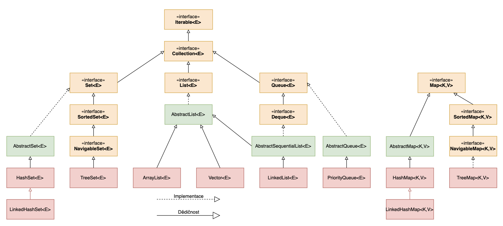
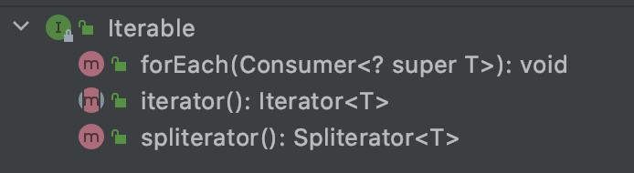
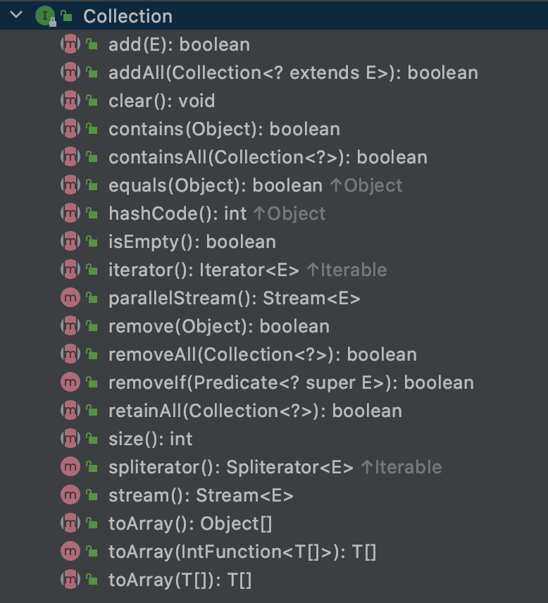
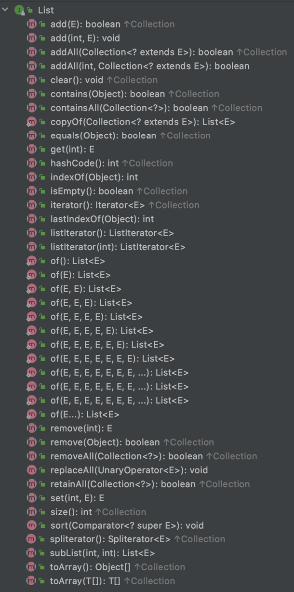
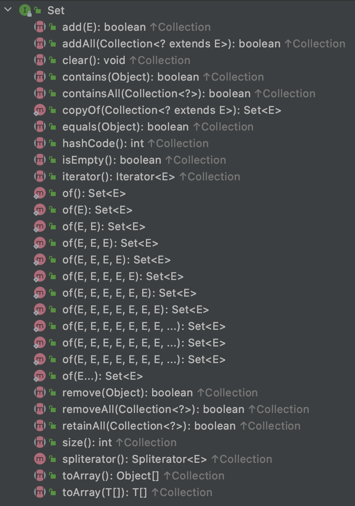
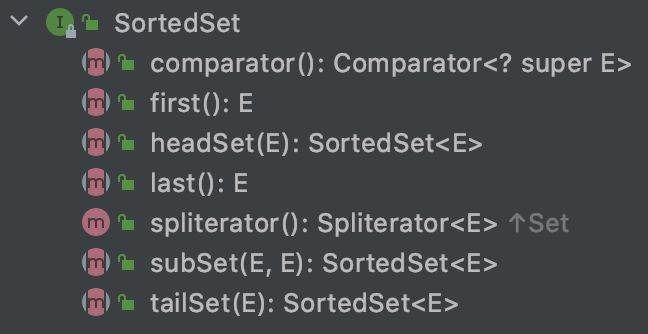
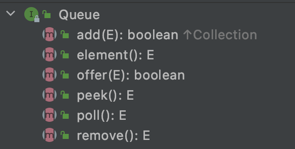
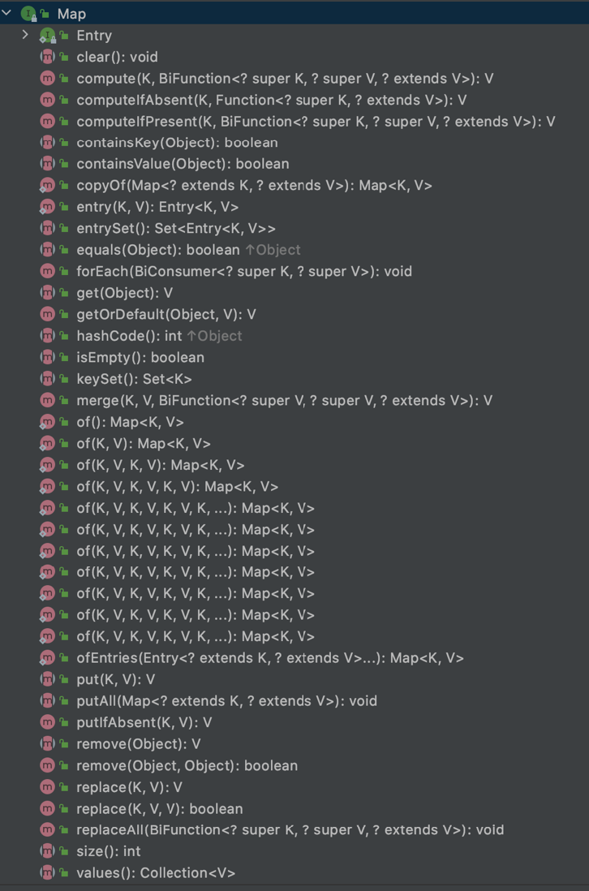
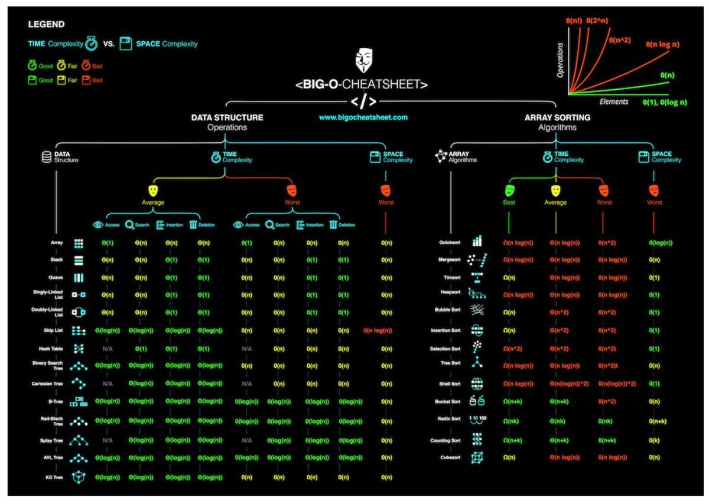
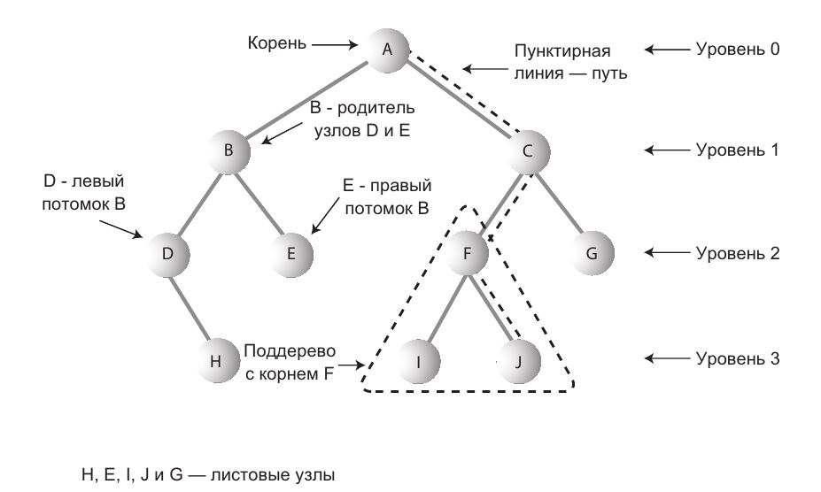

# Java Collection Framework

## Что такое Java Collections Framework? 
Java Collections Framework - это библиотека встроенная в JDK (Java Development Kit) в пакете java.util, 
которая создана для того, чтобы разработчик мог использовать готовые классы и интерфейсы 
для работы с наборами однородных объектов Java
## Из чего состоит Java Collection Framework?
- ### Java Collection Framework можно представить иерархией интерфейсов и классов
    - 
- ### Интерфейс Iterable
    - Методы:
    - 
- ### Интерфейс Collection
    - Наследует интерфейс Iterable
    - Методы:
    - 
- ### Интерфейс List
    - List (список) представляет собой коллекцию, в которой допустимы дублирующие значения. 
    Элементы такой коллекции пронумерованы, начиная от нуля, к ним можно обратиться по индексу
    - Наследует интерфейс Collection
    - Методы:
    - 
    - Интерфейс List реализован классами:
        - ArrayList - инкапсулирует в себе обычный массив, длина которого автоматически увеличивается 
        при добавлении новых элементов.
        - LinkedList (двунаправленный связный список) - состоит из узлов, каждый из которых содержит 
        как собственно данные, так и две ссылки на следующий и предыдущий узел
        - Vector — реализация динамического массива объектов, методы которой синхронизированы
        - Stack — реализация стека LIFO (last-in-first-out)
- ### Интерфейс Set
    - Set (сет) описывает неупорядоченную коллекцию, не содержащую повторяющихся элементов
    - Наследует интерфейс Collection
    - Методы:
    - 
    - Интерфейс Set реализован классами:
        - HashSet - использует HashMap для хранения данных. В качестве ключа и значения используется 
        добавляемый элемент. Из-за особенностей реализации порядок элементов не гарантируется при добавлении.
        - LinkedHashSet — гарантирует, что порядок элементов при обходе коллекции будет идентичен порядку добавления элементов.
        - EnumSet - это специализированная коллекция Set для работы с enum классами. Может содержать только enum 
        значения и все значения должны принадлежать к тому же enum. Не позволяет добавлять null значения
- ### Интерфейс SortedSet
    - Наследует интерфейс Set, который наследует интерфейс Collection
    - Методы:
    -   
    - Интерфейс SortedSet реализован классами:
        - TreeSet — предоставляет возможность управлять порядком элементов в коллекции 
        при помощи объекта Comparator, либо сохраняет элементы с использованием «natural ordering»
- ### Интерфейс Queue
    - Queue (очередь) предназначена для хранения элементов с предопределённым способом вставки и извлечения
    - Наследует интерфейс Collection
    - Методы:
    - 
    - Интерфейс Queue реализован классами:
        - PriorityQueue — предоставляет возможность управлять порядком элементов в коллекции 
        при помощи объекта Comparator, либо сохраняет элементы с использованием «natural ordering».
- ### Интерфейс Deque
    - Наследует интерфейс Queue
    - Методы:
    - 
    - Интерфейс Deque реализован классами:
        - ArrayDeque — реализация интерфейса Deque, который расширяет интерфейс Queue методами, 
        позволяющими реализовать конструкцию вида LIFO (last-in-first-out)
- ### Интерфейс Map
    - НЕ наследует интерфейс Collection
    - Методы: 
    - 
    - Интерфейс Map реализован классами:
        - Hashtable — хэш-таблица, методы которой синхронизированы. Не позволяет использовать null 
        в качестве значения или ключа и не является упорядоченной
        - HashMap — хэш-таблица. Позволяет использовать null в качестве значения или ключа и не является упорядоченной
        - LinkedHashMap — упорядоченная реализация хэш-таблицы.
        - TreeMap — реализация, основанная на красно-чёрных деревьях. 
        Является упорядоченной и предоставляет возможность управлять порядком элементов в коллекции при помощи 
        объекта Comparator, либо сохраняет элементы с использованием «natural ordering»
        - WeakHashMap — реализация хэш-таблицы, которая организована с использованием weak references 
        для ключей (сборщик мусора автоматически удалит элемент из коллекции при следующей сборке мусора, 
        если на ключ этого элемента нет жёстких ссылок)
        
## Что такое вычислительная сложность алгоритма и что такое O-нотация?
Вычислительная сложность - это функция зависимости объёма работы, которая выполняется некоторым алгоритмом, 
от размера входных данных. Объём работы обычно измеряется абстрактными понятиями времени и пространства, 
называемыми вычислительными ресурсами. Когда говорят о сложности алгоритма в терминах О-нотаций, то подразумевают 
асимптотическая сложность алгоритма. Важно отметить, что несмотря на то, что функция временной сложности 
алгоритма в некоторых случаях может быть определена точно, в большинстве случаев искать точное её значение бессмысленно. 
Дело в том, что, во-первых, точное значение временной сложности зависит от определения элементарных 
операций (например, сложность можно измерять в количестве арифметических операций, битовых операций 
или операций на машине Тьюринга), а во-вторых, при увеличении размера входных данных вклад постоянных множителей 
и слагаемых низших порядков, фигурирующих в выражении для точного времени работы, становится крайне незначительным.

- Например, мы можем точно посчитать алгоритмическую сложность T(n) = n + n = 2n
```java
void complexFunction(List list) {
    for (int i = 0; i < list.size; i++) {
	    someComplexLogic_1(); 
    }   
    for (int j =0; i < list.size; i++){
		someComplexLogic_2(); 
    }
}
```
- Но в терминах O-нотаций это будет O(n) = n

### Шпаргалка по вычислительной сложности в коллекциях
- 

Таблицы по средней сложности: 

|                      |get  | add  | contains | next | remove(0) | iterator.remove |
|----------------------|-----|------|----------|------|-----------|-----------------|
|ArrayList             |O(1) | O(1) | O(n)     | O(1) | O(n)      | O(n) |
|LinkedList            |O(n) | O(1) | O(n)     | O(1) | O(1)      | O(1) |
|CopyOnWrite-ArrayList |O(1) | O(n) | O(n)     | O(1) | O(n)      | O(n) |

|                      |add      | contains | next     | notes                    |
|----------------------|---------|----------|----------|-------------------------|
|HashSet               |O(1)     | O(1)     | O(h/n)   | h - размер таблицы |
|LinkedHashSet         |O(1)     | O(1)     | O(1)  | |
|CopyOnWriteArraySet   |O(n)     | O(n)     | O(1)  | |
|EnumSet               |O(1)     | O(1)     | O(1)  | |
|TreeSet               |O(log n) | O(log n) | O(log n) | |
|ConcurrentSkipListSet |O(log n) | O(log n) | O(1) | |

|                      | offer    | peek | poll     | size |
|----------------------|----------|------|----------|------|
|PriorityQueue         | O(log n) | O(1) | O(log n) | O(1) |
|ConcurrentLinkedQueue | O(1)     | O(1) | O(1)     | O(n) |
|ArrayBlockingQueue    | O(1)     | O(1) | O(1)     | O(1) |
|LinkedBlockingQueue   | O(1)     | O(1) | O(1)     | O(1) |
|PriorityBlockingQueue | O(log n) | O(1) | O(log n) | O(1) |
|DelayQueue            | O(log n) | O(1) | O(log n) | O(1) |
|LinkedList            | O(1)     | O(1) | O(1)     | O(1) |
|ArrayDeque            | O(1)     | O(1) | O(1)     | O(1) |
|LinkedBlockingDeque   | O(1)     | O(1) | O(1)     | O(1) |

## Что такое Iterator?
Iterator - объект, позволяющий перебирать элементы коллекции. 
Например foreach реализован с использованием итератора. 
Одним из ключевых методов интерфейса Collection является метод Iterator<E> iterator().
Метод Iterator<E> возвращает итератор - то есть объект, реализующий интерфейс Iterator.

## Как между собой связаны Iterable и Iterator и «for-each»?
- Интерфейс Iterable имеет только один метод - iterator(), который возвращает Iterator
- Классы, реализующие интерфейс Iterable, могут применяться в конструкции for-each, которая использует Iterator

## Как работает ArrayList?

### Какие интерфейсы реализует ArrayList?
```java
public class ArrayList<E> extends AbstractList<E>
        implements List<E>, RandomAccess, Cloneable, java.io.Serializable {
...
}
```

### ArrayList работает на простом массиве:
```java
/**
 * The array buffer into which the elements of the ArrayList are stored.
 * The capacity of the ArrayList is the length of this array buffer. Any
 * empty ArrayList with elementData == DEFAULTCAPACITY_EMPTY_ELEMENTDATA
 * will be expanded to DEFAULT_CAPACITY when the first element is added.
 */
transient Object[] elementData; // non-private to simplify nested class access
```

### Почему поле elementData помечено модификатором transient, неужели ArrayList не сериализуется?
ArrayList сериализуется и десериализуется, но пологается он на свой собственный механизм. 
Чтобы убедиться в этом достаточно посмотреть на реализацию методов writeObject() и readObject(). 
Любопытно, что во время сериализации ArrayList не сохраняет пустые значения, а использует параметр своего размера,
чтобы определенить сколько объектов записывать

### Как происходит измерение размера массива elementData? 
```java
/**
 * Increases the capacity to ensure that it can hold at least the
 * number of elements specified by the minimum capacity argument.
 *
 * @param minCapacity the desired minimum capacity
 * @throws OutOfMemoryError if minCapacity is less than zero
 */
private Object[] grow(int minCapacity) {
    return elementData = Arrays.copyOf(elementData,
                                       newCapacity(minCapacity));
}
```

### Происходит ли изменение размера массива быстрее чем O(n)?
Нет 
```java
/**
 * Copies the specified array, truncating or padding with nulls (if necessary)
 * so the copy has the specified length.  For all indices that are
 * valid in both the original array and the copy, the two arrays will
 * contain identical values.  For any indices that are valid in the
 * copy but not the original, the copy will contain {@code null}.
 * Such indices will exist if and only if the specified length
 * is greater than that of the original array.
 * The resulting array is of the class {@code newType}.
 *
 * @param <U> the class of the objects in the original array
 * @param <T> the class of the objects in the returned array
 * @param original the array to be copied
 * @param newLength the length of the copy to be returned
 * @param newType the class of the copy to be returned
 * @return a copy of the original array, truncated or padded with nulls
 *     to obtain the specified length
 * @throws NegativeArraySizeException if {@code newLength} is negative
 * @throws NullPointerException if {@code original} is null
 * @throws ArrayStoreException if an element copied from
 *     {@code original} is not of a runtime type that can be stored in
 *     an array of class {@code newType}
 * @since 1.6
 */
@HotSpotIntrinsicCandidate
public static <T,U> T[] copyOf(U[] original, int newLength, Class<? extends T[]> newType) {
    @SuppressWarnings("unchecked")
    T[] copy = ((Object)newType == (Object)Object[].class)
        ? (T[]) new Object[newLength]
        : (T[]) Array.newInstance(newType.getComponentType(), newLength);
    System.arraycopy(original, 0, copy, 0,
                     Math.min(original.length, newLength));
    return copy;
}
```
Код для проверки того, что работа System.arraycopy зависит от количества элементов в массиве

```java
public class Main {

  public static void main(String[] args) {
    int size = 5000000;
    for (int count = 0; count < 5; count++) {
      size = size * 2;
      long start, end;
      Integer[] integers = new Integer[size];
      Integer[] systemCopy = new Integer[size];

      start = System.currentTimeMillis();
      System.arraycopy(integers, 0, systemCopy, 0, size);
      end = System.currentTimeMillis();
      System.out.println(end - start);
    }
  }
}
```

### Какая размерность массива ArrayList по умолчанию? 
```java
/**
 * Default initial capacity.
 */
private static final int DEFAULT_CAPACITY = 10;
```

### Как уменьшить размер ArrayList?
Существует специальный метод, для того, чтобы оптимизировать размер ArrayList. Это может понадобится разработчику, например, когда
в ArrayList было сначала добавлено много элементов, а потом много удалено
```java
/**
 * Trims the capacity of this {@code ArrayList} instance to be the
 * list's current size.  An application can use this operation to minimize
 * the storage of an {@code ArrayList} instance.
 */
public void trimToSize() {
    modCount++;
    if (size < elementData.length) {
        elementData = (size == 0)
          ? EMPTY_ELEMENTDATA
          : Arrays.copyOf(elementData, size);
    }
}
```

## Как работает HashMap?

У класса Object есть два важных метода hashCode() и equals(Object obj), которые используются для корректной работы HashMap. 
Ключ, по которому кладется значение в HashMap, должен обязательно наследоваться от Object, следовательно, 
примитивные типы не могут быть ключами в HashMap.
Оба метода и hashCode() и equals(Object obj) вызываются у ключа, после того, как был вызван метод put(key, value). 

```java
/**
 * Returns a hash code value for the object. This method is
 * supported for the benefit of hash tables such as those provided by
 * {@link java.util.HashMap}.
 * <p>
 * The general contract of {@code hashCode} is:
 * <ul>
 * <li>Whenever it is invoked on the same object more than once during
 *     an execution of a Java application, the {@code hashCode} method
 *     must consistently return the same integer, provided no information
 *     used in {@code equals} comparisons on the object is modified.
 *     This integer need not remain consistent from one execution of an
 *     application to another execution of the same application.
 * <li>If two objects are equal according to the {@code equals(Object)}
 *     method, then calling the {@code hashCode} method on each of
 *     the two objects must produce the same integer result.
 * <li>It is <em>not</em> required that if two objects are unequal
 *     according to the {@link java.lang.Object#equals(java.lang.Object)}
 *     method, then calling the {@code hashCode} method on each of the
 *     two objects must produce distinct integer results.  However, the
 *     programmer should be aware that producing distinct integer results
 *     for unequal objects may improve the performance of hash tables.
 * </ul>
 * <p>
 * As much as is reasonably practical, the hashCode method defined
 * by class {@code Object} does return distinct integers for
 * distinct objects. (The hashCode may or may not be implemented
 * as some function of an object's memory address at some point
 * in time.)
 *
 * @return  a hash code value for this object.
 * @see     java.lang.Object#equals(java.lang.Object)
 * @see     java.lang.System#identityHashCode
 */
@HotSpotIntrinsicCandidate
public native int hashCode();

/**
 * Indicates whether some other object is "equal to" this one.
 * <p>
 * The {@code equals} method implements an equivalence relation
 * on non-null object references:
 * <ul>
 * <li>It is <i>reflexive</i>: for any non-null reference value
 *     {@code x}, {@code x.equals(x)} should return
 *     {@code true}.
 * <li>It is <i>symmetric</i>: for any non-null reference values
 *     {@code x} and {@code y}, {@code x.equals(y)}
 *     should return {@code true} if and only if
 *     {@code y.equals(x)} returns {@code true}.
 * <li>It is <i>transitive</i>: for any non-null reference values
 *     {@code x}, {@code y}, and {@code z}, if
 *     {@code x.equals(y)} returns {@code true} and
 *     {@code y.equals(z)} returns {@code true}, then
 *     {@code x.equals(z)} should return {@code true}.
 * <li>It is <i>consistent</i>: for any non-null reference values
 *     {@code x} and {@code y}, multiple invocations of
 *     {@code x.equals(y)} consistently return {@code true}
 *     or consistently return {@code false}, provided no
 *     information used in {@code equals} comparisons on the
 *     objects is modified.
 * <li>For any non-null reference value {@code x},
 *     {@code x.equals(null)} should return {@code false}.
 * </ul>
 * <p>
 * The {@code equals} method for class {@code Object} implements
 * the most discriminating possible equivalence relation on objects;
 * that is, for any non-null reference values {@code x} and
 * {@code y}, this method returns {@code true} if and only
 * if {@code x} and {@code y} refer to the same object
 * ({@code x == y} has the value {@code true}).
 * <p>
 * Note that it is generally necessary to override the {@code hashCode}
 * method whenever this method is overridden, so as to maintain the
 * general contract for the {@code hashCode} method, which states
 * that equal objects must have equal hash codes.
 *
 * @param   obj   the reference object with which to compare.
 * @return  {@code true} if this object is the same as the obj
 *          argument; {@code false} otherwise.
 * @see     #hashCode()
 * @see     java.util.HashMap
 */
public boolean equals(Object obj) {
    return (this == obj);
}
```

Когда мы помещаем пару ключ/значение в HashMap, то HashMap вычисляет хеш от ключа, вызывая метод hashCode() у ключа. 

```java
/**
 * Computes key.hashCode() and spreads (XORs) higher bits of hash
 * to lower.  Because the table uses power-of-two masking, sets of
 * hashes that vary only in bits above the current mask will
 * always collide. (Among known examples are sets of Float keys
 * holding consecutive whole numbers in small tables.)  So we
 * apply a transform that spreads the impact of higher bits
 * downward. There is a tradeoff between speed, utility, and
 * quality of bit-spreading. Because many common sets of hashes
 * are already reasonably distributed (so don't benefit from
 * spreading), and because we use trees to handle large sets of
 * collisions in bins, we just XOR some shifted bits in the
 * cheapest possible way to reduce systematic lossage, as well as
 * to incorporate impact of the highest bits that would otherwise
 * never be used in index calculations because of table bounds.
 */
static final int hash(Object key) {
    int h;
    return (key == null) ? 0 : (h = key.hashCode()) ^ (h >>> 16);
}
```

Вычисленное значение hashCode берется по модулю от количества bucket'ов в HashMap и помещается по номеру вычисленной позиции
в нужный bucket.

```java
/**
 * The table, initialized on first use, and resized as
 * necessary. When allocated, length is always a power of two.
 * (We also tolerate length zero in some operations to allow
 * bootstrapping mechanics that are currently not needed.)
 */
transient Node<K,V>[] table;
```

Если в bucket`е по вычисленной позицией уже имеются другие пары ключ/значение, тогда HashMap пробегается по списку объектов 
и сравнивает ключ с уже лежащими ключами с помощью метода equals(Object obj).

### Какая размерность HashMap по умолчанию?

```java
/**
 * The default initial capacity - MUST be a power of two.
 */
static final int DEFAULT_INITIAL_CAPACITY = 1 << 4; // aka 16
```
### Как и когда происходит увеличение количества корзин в HashMap?

Помимо capacity у HashMap есть еще поле loadFactor, на основании которого, 
вычисляется предельное количество занятых корзин capacity * loadFactor. 
По умолчанию loadFactor = 0.75. По достижению предельного значения, число корзин увеличивается в 2 раза и для всех 
хранимых элементов вычисляется новое «местоположение» с учетом нового числа корзин.

## Когда и какую коллекцию применять?

- ArrayList - это список, реализованный на основе массива с доступом к произвольному элементу по индексу за постоянное время O(1).
Используется в среднем чаще всего. 
Пример использования: список учеников в группе. В данном случае не требуется добавлять студентов в середину списка, т.к. 
их порядок не важен, поэтому ArrayList идеально подходит. Выведем на экран всех студентов группы. Сложность O(n).
```java

public class Main {

  public static void main(String[] args) {
    List<String> students = new ArrayList<>(Arrays.asList(
    "Владимир",
    "Александр",
    "Леонид",
    "Петр"
    ));
    students.forEach(System.out::println);
  }
}

```

- LinkedList — это классический связный список, основанный на объектах с ссылками между ними.
Преимуществом перед ArrayList является вставка/удаление объектов в середине списка (O(n) в ArrayList против O(1) в LinkedList).
Но доступ к объекту в ArrayList быстрее, чем в LinkedList (O(1) в ArrayList против O(n) в LinkedList).
Поэтому, LinkedList предпочтительно применять, когда происходит активная работа (вставка/удаление) с серединой списка 
или в случаях, когда необходимо гарантированное время добавления элемента в список.
Внутри класса LinkedList существует static inner класс Entry, с помощью которого создаются новые элементы. 
next и prev являются ссылками на следующий и предыдущий элементы списка.

```java
private static class Entry<E>
{
    E element;
    Entry<E> next;
    Entry<E> prev;
	
    Entry(E element, Entry<E> next, Entry<E> prev)
    {
        this.element = element;
        this.next = next;
        this.prev = prev;
    }
}
```

Каждый раз при добавлении нового элемента, по сути выполняется два шага:

1) создается новый новый экземпляр класса Entry
```java
Entry newEntry = new Entry("0", header, header.prev);
```

2) переопределяются указатели на предыдущий и следующий элемент

```java
newEntry.prev.next = newEntry;
newEntry.next.prev = newEntry;
size++;
```
Пример: 
Допустим, имеется некий новостной сайт, где каждый день редактор через CMS вручную формирует ленту, ранжируя ленту по 
по интересу. Следовательно, ведется активная работа с  добавлением новых элементов в середину списка.

```java

public class Main {

    public static void main(String[] args) {
        LinkedList<NewsItem> list = new LinkedList<>(Arrays.asList(
                new NewsItem("LinkedList vs ArrayList", "LinkedList ..."),
                new NewsItem("Collections in Java 8", "Коллекции ...")
        ));
        addItem(list, 1, new NewsItem("Spring Framework", "Spring ..."));
        System.out.println(list.get(1));
    }

    public static LinkedList<NewsItem> addItem(LinkedList<NewsItem> newsItems, int index, NewsItem item) {
        newsItems.add(index, item);
        return newsItems;
    }

    static class NewsItem {
        private String title;
        private String content;

        public NewsItem(String title, String content) {
            this.content = content;
            this.title = title;
        }

        @Override
        public String toString(){
            return title + System.lineSeparator() + content;
        }
        //getters, setters
    }
}

```

Результат выполнения кода с LinkedList:
```
Spring Framework
Spring ...
```
 
- Vector очень похож на ArrayList, оба по сути являются динамическим массивом, Однако есть следующие различия:
1) Синхронизация: ArrayList не синхронизирован, что означает одновременное использование нескольких потоков в ArrayList.
Например, если один поток выполняет операцию добавления в ArrayList, может быть другой поток, выполняющий операцию 
удаления в ArrayList одновременно в многопоточной среде.
В то время как вектор синхронизирован. Это означает, что если один поток работает над Vector, ни один другой поток
не сможет его удержать. В отличие от ArrayList, только один поток может выполнять операцию по вектору за раз.

2) Изменение размера: Оба ArrayList и Vector могут динамически увеличиваться и сжиматься, чтобы поддерживать оптимальное
использование хранилища, однако способ изменения размеров отличается. ArrayList увеличивается на половину своего размера 
при изменении размера, в то время как Vector удваивает размер по умолчанию, когда растет.

3) Производительность: ArrayList дает лучшую производительность, так как он не синхронизирован. 
Операции с вектором дают низкую производительность, так как они потокобезопасны, поток, который работает на Vector, 
получает блокировку, которая заставляет другой поток ждать, пока блокировка не будет выпущена.

Vector считается устаревшим классом и вместо него обычно используется ArrayList.

- Stack является подклассом класса Vector, который реализует простой механизм типа "последний вошёл - первый вышел" (LIFO).

Отличительные методы Stack:

```
push() — добавляет элемент на верх стека. Когда мы добавляем элемент в стек, он становится на первое место;
pop() — удаляет верхний элемент из стека и возвращает его. 
peek() — возвращает верхний элемент стека, но не удаляет его из стека
```

Пример использования: некий аналог электронной почты, новые письма будут складываться в стек, где новые письма будут 
читаться в первую очередь

```java

public class Main {

    public static void main(String[] args) {
        Stack<Letter> stack = new Stack<>();
        stack.add(new Letter("Подписка на курс Java", "Приглашаем Вас на курс ..."));
        stack.add(new Letter("Оффер", "Добрый день! Наша компания готова предложить Вам ..."));
        System.out.println(stack.peek());
    }


    static class Letter {
        private String title;
        private String text;

        public Letter(String title, String text) {
            this.text = text;
            this.title = title;
        }

        @Override
        public String toString(){
            return title + System.lineSeparator() + text;
        }
        //getters, setters
    }
}

```

Результат выполнения кода со Stack:

```
Оффер
Добрый день! Наша компания готова предложить Вам ...
```

- Queue - очередь. В java является интерфейсом. В отличии от стека очередь основана не на LIFO, а на другом принципе —
FIFO (“first in — first out”, 
“первым вошел — первым вышел”). 

Реализована большим количеством классов:

```
AbstractQueue, ArrayBlockingQueue, ArrayDeque

ConcurrentLinkedDeque, ConcurrentLinkedQueue, DelayQueue

LinkedBlockingDeque, LinkedBlockingQueue, LinkedList, LinkedTransferQueue

PriorityBlockingQueue, PriorityQueue, SynchronousQueue
```

Отличительные методы Queue:

```
offer() — добавляет элемент в начало очереди. В отличии от add() не бросает IllegalStateException при отсутствии 
свободного места
peek() — возвращает первый элемент очереди, но не удаляет его из очереди. Может вернуть null в отличии от element(), 
который бросает NoSuchElementException
poll() — удаляет первый элемент из очереди и возвращает его. Может вернуть null в отличии от remove(), который бросает 
NoSuchElementException
```

Пример использования: интересным примером является реализация PriorityQueue, которая позволяет обрабатывать элементы в очереди,
основанной на приоритете за счет Comparator. 

Пример: электронная очередь в отделении Сбербанка, где VIP клиентов надо обслуживать в первую очередь.

```java
    public class Main {
    
        public static void main(String[] args) {
    
            //Очередь без vip клиентов
            Queue<Integer> integerPriorityQueue = new PriorityQueue<>(7);
            Random rand = new Random();
            for (int i = 0; i < 7; i++) {
                integerPriorityQueue.add(rand.nextInt(100));
            }
            for (int i = 0; i < 7; i++) {
                Integer in = integerPriorityQueue.poll();
                System.out.println("Обрабатываем Integer:" + in);
            }
    
            System.out.println("Обработка очереди с VIP клиентами: ");
            //Пример PriorityQueue с компаратором (VIP клиенты)
            Queue<Integer> customerPriorityQueue = new PriorityQueue<>(7, idComparator);
            for (int i = 0; i < 7; i++) {
                customerPriorityQueue.add(rand.nextInt(100));
            }
            while (true) {
                Integer customer = customerPriorityQueue.poll();
                if (customer == null) break;
                System.out.println("Обработка клиента с id= " + customer);
            }
    
        }
    
        //Анонимный класс компаратора
        public static Comparator<Integer> idComparator = new Comparator<>() {
    
            @Override
            public int compare(Integer c1, Integer c2) {
                return c2- c1;
            }
        };
    
    }
   
```

Результат выполнения программы, как можно увидеть за счет компаратора VIP клиенты с большим номером обрабатываются 
в первую очередь:
```
Обрабатываем Integer:3
Обрабатываем Integer:20
Обрабатываем Integer:37
Обрабатываем Integer:62
Обрабатываем Integer:72
Обрабатываем Integer:93
Обрабатываем Integer:98
Обработка очереди с VIP клиентами:
Обработка клиента с id= 91
Обработка клиента с id= 86
Обработка клиента с id= 67
Обработка клиента с id= 49
Обработка клиента с id= 25
Обработка клиента с id= 17
Обработка клиента с id= 9
```

- Deque - двусторонняя очередь. В java является интерфейсом. Расширяет вышеописанный интерфейс Queue.

Интерфейс Deque определяет следующие методы:

```
addFirst(E obj): добавляет элемент в начало очереди

addLast(E obj): добавляет элемент obj в конец очереди

getFirst(): возвращает без удаления элемент из головы очереди. Если очередь пуста, бросает исключение NoSuchElementException

getLast(): возвращает без удаления последний элемент очереди. Если очередь пуста, бросает исключение NoSuchElementException

offerFirst(E obj): добавляет элемент obj в самое начало очереди. Если элемент удачно добавлен, возвращает true, иначе - false

offerLast(E obj): добавляет элемент obj в конец очереди. Если элемент удачно добавлен, возвращает true, иначе - false

peekFirst(): возвращает без удаления элемент из начала очереди. Если очередь пуста, возвращает значение null

peekLast(): возвращает без удаления последний элемент очереди. Если очередь пуста, возвращает значение null

pollFirst(): возвращает с удалением элемент из начала очереди. Если очередь пуста, возвращает значение null

pollLast(): возвращает с удалением последний элемент очереди. Если очередь пуста, возвращает значение null

pop(): возвращает с удалением элемент из начала очереди. Если очередь пуста, генерирует исключение NoSuchElementException

push(E element): добавляет элемент в самое начало очереди

removeFirst(): возвращает с удалением элемент из начала очереди. Если очередь пуста, бросает исключение NoSuchElementException

removeLast(): возвращает с удалением элемент из конца очереди. Если очередь пуста, бросает исключение NoSuchElementException

removeFirstOccurrence(Object obj): удаляет первый встреченный элемент obj из очереди. Если удаление произшло, то возвращает true, иначе возвращает false.

removeLastOccurrence(Object obj): удаляет последний встреченный элемент obj из очереди. Если удаление произшло, то возвращает true, иначе возвращает false.

```
Таким образом, наличие методов pop и push позволяет классам, реализующим этот элемент, действовать в качестве стека. 
В тоже время имеющийся функционал также позволяет создавать двунаправленные очереди, что делает классы, применяющие данный интерфейс, довольно гибкими.

Реализован следующими классами:

```
ArrayDeque, 
ConcurrentLinkedDeque, 
LinkedBlockingDeque, 
LinkedList
```

Пример использования: интересным примером использования является ArrayDeque. Этот класс представляют обобщенную 
двунаправленную очередь, наследуя функционал от класса AbstractCollection и применяя интерфейс Deque.
Допустим, студенты организуют очередь отвечающих на зачете, где уверенные в себе студенты могут пойти первыми,
а остальные могут пойти в конце.

```java

public class Main {

    public static void main(String[] args) {

        Deque<String> studentsDeque = new ArrayDeque<>(7);
        studentsDeque.addFirst("Иван");
        studentsDeque.addLast("Петр");
        studentsDeque.addLast("Василий");
        studentsDeque.addFirst("Андрей");
        studentsDeque.addLast("Алексей");
        studentsDeque.addFirst("Егор");
        studentsDeque.addFirst("Иннокентий");
        studentsDeque.forEach(System.out::println);
    }
}
```
Результат выполнения программы, как видим, те студенты, которые заняли первое место в последнюю очередь, занимает 
приоритетное место, в то время, как студенты, занимающие последнее место, пойдут отвечать последними:

```
Иннокентий
Егор
Андрей
Иван
Петр
Василий
Алексей
```

- Set - описывает неупорядоченную коллекцию, содержащую уникальные элементы. В Java является интерфейсом.

Реализован следующими классами:
```
AbstractSet, ConcurrentSkipListSet, CopyOnWriteArraySet, 
EnumSet, HashSet, JobStateReasons, LinkedHashSet, TreeSet
```

- HashSet - как понятно из названия основан на использовании хэш-функции. В классах объектов, заносимых в HashSet, 
метод hashcode() должен быть переопределен (override).

Методы аналогичны методам ArrayList за исключением того, что метод add(Object o) добавляет объект в множество
только в том случае, если его там нет. Возвращаемое методом значение — true, 
если объект добавлен, и false, если нет.

Пример использования: пользователь записывает список стран, которые он успел посетить за свою жизнь. Естественно, что 
в этом случае каждый элемент списка должен быть уникален, ведь в мире не существует одинаковых стран. В данном случае 
список заполняется элементами типа String, где hashcode() переопределен:

```java
public class Main {

    public static void main(String[] args) {

        Set<String> countries = new HashSet<>();
        countries.add("Россия");
        countries.add("Украина");
        countries.add("Белоруссия");
        countries.add("Россия");
        countries.add("Швеция");
        countries.add("Швеция");
        countries.add("Белоруссия");
        countries.forEach(System.out::println);
    }
}

```

Результат выполнения программы: как можно увидеть, несмотря на добавление одинаковых стран, каждая добавилась в список 
только один раз:
```
Россия
Украина
Белоруссия
Швеция
```

- LinkedHashSet. Класс LinkedHashSet расширяет класс HashSet, не добавляя никаких новых методов.
Класс поддерживает связный список элементов набора в том порядке, в котором они вставлялись. 
Это позволяет организовать упорядоченную итерацию вставки в набор. 

Пример использования: ведение справочника посещенных городов в правильном порядке.

- EnumSet. Cпециализированная коллекция Set для работы с enum классами.
EnumSet всегда следует отдавать предпочтение перед любой другой реализацией Set, когда мы храним значения enum.
Все методы в EnumSet реализованы с использованием арифметических побитовых операций. 
Эти вычисления очень быстрые, и поэтому все основные операции выполняются в постоянное время.

Самыми простыми способами создания EnumSet являются allOf() и noneOf().

```java
public enum Color {
    RED, YELLOW, GREEN, BLUE, BLACK, WHITE
}
```

Данный код создаст список, состоящий из всех цветов, перечисленных в Enum Color:
```java
    EnumSet<Color> enumSet = EnumSet.allOf(Color.class);
    enumSet.forEach(System.out::println);
    System.out.println("Пустой EnumSet: ");
    EnumSet<Color> emptyEnumSet = EnumSet.noneOf(Color.class);
    emptyEnumSet.forEach(System.out::println);
```

Результат:
```
RED
YELLOW
GREEN
BLUE
BLACK
WHITE
Пустой EnumSet: 

```

Другой способ создать подмножество enum - использовать метод range()

```java
    EnumSet<Color> enumSet = EnumSet.range(Color.YELLOW, Color.BLUE);
    enumSet.forEach(System.out::println);
```

Результат:
```
YELLOW
GREEN
BLUE
```
Обратите внимание, что он включает в себя как первый, так и последний указанные элементы.

Другим полезным фабричным методом является complementOf (), который позволяет исключать элементы, 
передаваемые в качестве параметров. Давайте создадим EnumSet со всеми элементами Color, кроме черного и белого:

```java
    EnumSet<Color> enumSet = EnumSet.complementOf(EnumSet.of(Color.BLACK, Color.WHITE));
    enumSet.forEach(System.out::println);
```
Результат: 
```
RED
YELLOW
GREEN
BLUE
```

- SortedSet. Описывает упорядоченную коллекцию, содержащую уникальные элементы. В Java является интерфейсом.
             
Реализован следующими классами:
```
ConcurrentSkipListSet, TreeSet
```
             
-TreeSet. Хранит уникальные элементы, при этом не сохраняет порядок вставки элементов, а сортирует элементы в порядке 
возрастания.

Пример использования: Вернемся к примеру из HashSet. В данном случае список стран будет выведен в порядке natural ordering 
(в алфавитном порядке). 
```java
public class Main {

    public static void main(String[] args) {

        Set<String> countries = new TreeSet<>();
        countries.add("Россия");
        countries.add("Украина");
        countries.add("Белоруссия");
        countries.add("Россия");
        countries.add("Швеция");
        countries.add("Швеция");
        countries.add("Белоруссия");
        countries.forEach(System.out::println);
    }
}
```

Результат: 
```
Белоруссия
Россия
Украина
Швеция
```

Так же можно задать свой Comparator для сортировки. Выведем список стран, отсортированный по длине названия страны.

```java
public class Main {

    public static void main(String[] args) {
        Set<String> countries = new TreeSet<>(Comparator.comparing(String::length));
        countries.add("Россия");
        countries.add("Украина");
        countries.add("Белоруссия");
        countries.add("Россия");
        countries.add("Финляндия");
        countries.add("Финляндия");
        countries.add("Белоруссия");
        countries.forEach(System.out::println);
    }
}

```

Результат:

```
Россия
Украина
Финляндия
Белоруссия
```

Отличительные методы TreeSet:

```
TreeSet first(). Этот метод возвращает первый элемент из TreeSet, если он не пустой. В противном случае он генерирует исключение NoSuchElementException.
TreeSet last().Аналогично приведенному выше примеру, этот метод вернет последний элемент, если набор не пустой:
TreeSet subSet(). Этот метод возвращает элементы в диапазоне от fromElement до toElement. Обратите внимание, что fromElement является включающим, а toElement - исключительным
TreeSet headSet(). Этот метод вернет элементы TreeSet , которые меньше указанного элемента.
TreeSet tailSet(). Этот метод вернет элементы TreeSet , которые больше или равны указанному элементу:
```

- Map. Не является коллекций! Представляет собой пары элементов в виде: ключ/значение. В Java является интерфейсом.

Реализована большим количеством классов:

```
AbstractMap, Attributes, AuthProvider, ConcurrentHashMap, 
ConcurrentSkipListMap, EnumMap, HashMap, Hashtable, 
IdentityHashMap, LinkedHashMap, PrinterStateReasons, 
Properties, Provider, RenderingHints, SimpleBindings, 
TabularDataSupport, TreeMap, UIDefaults, WeakHashMap
```

Основные методы:
```
void clear(): очищает коллекцию

boolean containsKey(Object k): возвращает true, если коллекция содержит ключ k

boolean containsValue(Object v): возвращает true, если коллекция содержит значение v

Set<Map.Entry<K, V>> entrySet(): возвращает набор элементов коллекции. Все элементы представляют объект Map.Entry

boolean equals(Object obj): возвращает true, если коллекция идентична коллекции, передаваемой через параметр obj

boolean isEmpty: возвращает true, если коллекция пуста

V get(Object k): возвращает значение объекта, ключ которого равен k. Если такого элемента не окажется, то возвращается значение null

V getOrDefault(Object k, V defaultValue): возвращает значение объекта, ключ которого равен k. Если такого элемента не окажется, то возвращается значение defaultVlue

V put(K k, V v): помещает в коллекцию новый объект с ключом k и значением v. Если в коллекции уже есть объект с подобным ключом, то он перезаписывается. После добавления возвращает предыдущее значение для ключа k, если он уже был в коллекции. Если же ключа еще не было в коллекции, то возвращается значение null

V putIfAbsent(K k, V v): помещает в коллекцию новый объект с ключом k и значением v, если в коллекции еще нет элемента с подобным ключом.

Set<K> keySet(): возвращает набор всех ключей отображения

Collection<V> values(): возвращает набор всех значений отображения

void putAll(Map<? extends K, ? extends V> map): добавляет в коллекцию все объекты из отображения map

V remove(Object k): удаляет объект с ключом k

int size(): возвращает количество элементов коллекции
```

- HashMap. Наиболее распространенная реализация интерфейса Map. Как понятно из названия использует хэш-функции. 
При этом порядок хранения ключей случайный.
Пример использования: смаппить автора и его книги.

```java
public class Main {

    public static void main(String[] args) {
        Map<String, List<String>> authors = new HashMap<>();
        authors.put("Достоевский", Arrays.asList("Преступление и наказание", "Идиот"));
        authors.put("Донцова", Arrays.asList("Крутые наследнички", "За всеми зайцами"));
        authors.put("Пушкин", Arrays.asList("Капитанская дочка", "Руслан и Людмила"));

        //Получить список книг Пушкина
        System.out.println(authors.get("Пушкин"));

        //Если добавить в "мапу" объект по существующему ключ, то он перезапишется
        authors.put("Донцова", Arrays.asList("Белый конь на принце", "Несекретные материалы"));

        System.out.println(authors.get("Донцова"));

        //Так же можно вставить "мапу" в "мапу" с помощью putAll()
        Map<String, List<String>> otherAuthors = new HashMap<>();
        otherAuthors.put("Роулинг", Arrays.asList("Гарри Поттер и Филосовский Камень", "Гарри Поттер и Тайная Комната"));
        otherAuthors.put("Фонвизин", Collections.singletonList("Недоросль"));

        authors.putAll(otherAuthors);

        for (Map.Entry<String, List<String>> entry : authors.entrySet()) {
            System.out.println(entry.getKey() + ":" + entry.getValue());
        }
    }
}
```
Результат:
```
[Капитанская дочка, Руслан и Людмила]
[Белый конь на принце, Несекретные материалы]
Пушкин:[Капитанская дочка, Руслан и Людмила]
Фонвизин:[Недоросль]
Роулинг:[Гарри Поттер и Филосовский Камень, Гарри Поттер и Тайная Комната]
Донцова:[Белый конь на принце, Несекретные материалы]
Достоевский:[Преступление и наказание, Идиот]
```

-Hashtable. Основное отличие от HashMap:
```
- Методы синхронизированы. 
- Не позволяет использовать null в качестве значения или ключа
```

- LinkedHashMap — упорядоченная реализация хэш-таблицы. Принцип схож со связанным списком.
Класс LinkedHashMap хранит элементы типа “ключ – значение” в том порядке, в котором они были добавлены. 
Это означает, что когда мы захотим вывести содержимое структуры данных мы получим их не упорядоченными 
по возрастанию, а в порядке добавления.

В качестве примера можно взять пример из HashMap, и убедиться, что в результате мы не потеряем порядок, в котором производили добавление:

```java
public class Main {

    public static void main(String[] args) {
        Map<String, List<String>> authors = new LinkedHashMap<>();
        authors.put("Достоевский", Arrays.asList("Преступление и наказание", "Идиот"));
        authors.put("Донцова", Arrays.asList("Крутые наследнички", "За всеми зайцами"));
        authors.put("Пушкин", Arrays.asList("Капитанская дочка", "Руслан и Людмила"));
        authors.put("Донцова", Arrays.asList("Белый конь на принце", "Несекретные материалы"));
        authors.put("Роулинг", Arrays.asList("Гарри Поттер и Филосовский Камень", "Гарри Поттер и Тайная Комната"));
        authors.put("Фонвизин", Collections.singletonList("Недоросль"));

        for (Map.Entry<String, List<String>> entry : authors.entrySet()) {
            System.out.println(entry.getKey() + ":" + entry.getValue());
        }
    }
}
```
Результат:
```
Достоевский:[Преступление и наказание, Идиот]
Донцова:[Белый конь на принце, Несекретные материалы]
Пушкин:[Капитанская дочка, Руслан и Людмила]
Роулинг:[Гарри Поттер и Филосовский Камень, Гарри Поттер и Тайная Комната]
Фонвизин:[Недоросль]
```

- TreeMap. Он создает "коллекцию", которая для хранения элементов применяет дерево. 
Объекты сохраняются в отсортированном порядке по возрастанию (в отличии от HashMap где порядок случаен, и LinkedHashMap,
где сохраняется порядок добавления).
Время доступа и извлечения элементов достаточно мало, что делает класс TreeMap блестящим выбором для хранения больших 
объемов отсортированной информации, которая должна быть быстро найдена.

Пример: в качестве примера продолжим работу с нашим справочником автором. Не используя кастомных компараторов наши авторы 
будут храниться в алфавитном порядке:

```java

public class Main {

    public static void main(String[] args) {
        Map<String, List<String>> authors = new TreeMap<>();
        authors.put("Достоевский", Arrays.asList("Преступление и наказание", "Идиот"));
        authors.put("Донцова", Arrays.asList("Крутые наследнички", "За всеми зайцами"));
        authors.put("Пушкин", Arrays.asList("Капитанская дочка", "Руслан и Людмила"));
        authors.put("Донцова", Arrays.asList("Белый конь на принце", "Несекретные материалы"));
        authors.put("Роулинг", Arrays.asList("Гарри Поттер и Филосовский Камень", "Гарри Поттер и Тайная Комната"));
        authors.put("Фонвизин", Collections.singletonList("Недоросль"));

        for (Map.Entry<String, List<String>> entry : authors.entrySet()) {
            System.out.println(entry.getKey() + ":" + entry.getValue());
        }
    }
}
```

Результат:
```
Донцова:[Белый конь на принце, Несекретные материалы]
Достоевский:[Преступление и наказание, Идиот]
Пушкин:[Капитанская дочка, Руслан и Людмила]
Роулинг:[Гарри Поттер и Филосовский Камень, Гарри Поттер и Тайная Комната]
Фонвизин:[Недоросль]
```

Так же можно использовать кастомный компаратор и хранить авторов по увеличению длины их фамилии:

```java

public class Main {

    public static void main(String[] args) {
        Map<String, List<String>> authors = new TreeMap<>(Comparator.comparing(String::length));
        authors.put("Достоевский", Arrays.asList("Преступление и наказание", "Идиот"));
        authors.put("Пушкин", Arrays.asList("Капитанская дочка", "Руслан и Людмила"));
        authors.put("Роулинг", Arrays.asList("Гарри Поттер и Филосовский Камень", "Гарри Поттер и Тайная Комната"));
        authors.put("Фонвизин", Collections.singletonList("Недоросль"));

        for (Map.Entry<String, List<String>> entry : authors.entrySet()) {
            System.out.println(entry.getKey() + ":" + entry.getValue());
        }
    }
}

```

Результат:

```
Пушкин:[Капитанская дочка, Руслан и Людмила]
Роулинг:[Гарри Поттер и Филосовский Камень, Гарри Поттер и Тайная Комната]
Фонвизин:[Недоросль]
Достоевский:[Преступление и наказание, Идиот]
```

- WeakHashMap. Является реализацией интерфейса Map, который хранит только слабые ссылки в качестве ключей.
Это позвоялет сборщику мусора удалять элемент структуры в том случае, если на ключ элемента типа “ключ – значение”
за пределами таблицы никто не ссылается.
 
Этот класс крайне полезен, если нам необходимо сразу удалять значение, когда оно становится недоступным для других 
процессов (в условиях ограниченности физических ресурсов). 
 
Забегая вперед к теме GarbageCollector: если на объект ссылается только слабая ссылка, 
он будет удалён при мервом же вызове сборщика мусора. 
Что и позволяет нам избежать OutOfMemoryError.


```
public class Main {

    public static void main(String[] args) throws InterruptedException {
        WeakHashMap<String, String> map = new WeakHashMap<>();
        String firstKey = "foo";
        String firstValue = "bar";

        String secondKey = "foo2";
        String secondValue = "bar2";

        map.put(firstKey, firstValue);
        map.put(secondKey, secondValue);

        System.out.println(map.containsKey(firstKey));
        System.out.println(map.containsKey(secondKey));

        //Обнуляем ссылку на первый ключ
        firstKey = null;
        //Играемся со сборщиком мусора
        System.gc();

        Awaitility.await().atMost(10, TimeUnit.SECONDS)
                .until(() -> map.size() == 1);
        Awaitility.await().atMost(10, TimeUnit.SECONDS)
                .until(() -> map.containsKey(secondKey));
        //Выводим мапу и убеждаемся, что в ней остался только второй ключ
        for (Map.Entry<String, String> entry : map.entrySet()) {
            System.out.println(entry.getKey() + ":" + entry.getValue());
        }
    }
}

```

Результат:

```
 true
 true
 foo2:bar2
```

## В чем разница между классами java.util.Collection и java.util.Collections?
- java.util.Collections - набор статических методов для работы с коллекциями
- java.util.Collection - один из основных интерфейсов Java Collections Framework

## Как отсортировать коллекцию?

Сортировать коллекции можно многими способами. Зачастую самый простой использовать статические методы sort() в классах 
Collections или Arrays. Также в List есть метод sort(), который вызовет статический метод sort() в классе Arrays.
Важно понимать, что порядок сортировки объекта нужно явно задать либо c помощью имплементации интерфейса Comparable 
в самом классе объекта, коллекцию которых мы хотим сортировать, либо с помощью реализации функционального интерфейса 
Comparator и передачи его в качестве параметра.  

## Как устроены деревья?
- 

## Что такое балансировка в дереве?

Балансировка - это процесс перестроения дерева, при котором удается получить примерно одинаковое количество узлов
до листьев и любой проход вниз до листьев будет содержать примерно одинаковое количество элементов.
Дерево считается сбалансированным если имеет примерно одинаковое количество 
элементов относительно корня в каждой его ветке. 
Если дерево сбалансированное, то операции с ним будут выполняться быстрее.

## Почему нельзя использовать byte[] в качестве ключа в HashMap?

Хэш-код массива не зависит от хранимых в нем элементов, а присваивается при создании массива 
(метод вычисления хэш-кода массива не переопределен и вычисляется по стандартному Object.hashCode() на основании адреса 
массива). Так же у массивов не переопределен equals и выполняется сравнение указателей. 
Это приводит к тому, что обратиться к сохраненному с ключом-массивом элементу не получится при использовании другого 
массива такого же размера и с такими же элементами, доступ можно осуществить лишь в одном случае — при использовании 
той же самой ссылки на массив, что использовалась для сохранения элемента.