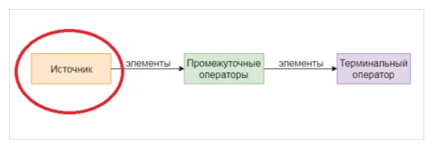

# Stream API
**Вступительные вопросы:**
* Кто работал с stream API ранее?
* *Опциональная задачка: если есть кто неработал* 

    Как бы вы отфильтровали список строк и вывели в консоль?
    
    Пример решения с помощью цикла:
    ```java
    List<String> list = List.of("Alex", "Mike", "Tony", "Artur", "Nick");
        for (String name: list) {
            if(name.startsWith("A")){
                System.out.println(name);
            }
        }
    ```
    Но гораздо изящнее и компактнее эту задачу можно решить с помощью стримов, которые появились в Java 8:
    ```java
        List<String> list = List.of("Alex", "Mike", "Tony", "Artur", "Nick");
        list.stream()
                .filter(name -> name.startsWith("A"))
                .forEach(System.out::println);
    ```
В данном примере выгода в количестве строк может показаться не столь очевидна, но поверьте, когда вашей задачей будет модифицировать несколько раз данные, отфильтровать их итд, код со стримами будет в разы изящнее, чем альтернативное награмождение циклов for и условий через if. 

## Теория
### Что такое Stream API
Stream - интерфейс, предоставляющий функциональные возможности обработки коллекций.
Проще говоря, поток - это итератор, роль которого состоит в том, чтобы принять набор действий для применения к каждому из элементов, которые он содержит.

Поток представляет последовательность объектов из источника, такого как коллекция, которая поддерживает агрегатные операции. Они были разработаны, чтобы сделать обработку коллекции простой и лаконичной.

Коллекции позволяют работать с элементами по-отдельности, тогда как стримы так делать не позволяют, но вместо этого предоставляют возможность выполнять функции над данными как над одним целым.

Основные "свойства" стримов:
* Стрим - не структура данных! Он ничего не хранит. И не гарантирует порядок хранения данных
* Все выполнение операций отложено до последнего (lazy операции) 
* Не изменяют исходных источник данных (только те, что сделаны в jdk)
* одноразовый - нельзя один стрим использовать несколько раз! одна терминальная операция == один стрим
* параллельный/однопоточный
* может быть бесконечным

### Виды операций в стримах
Java Stream API предлагает два вида методов:
1. Конвейерные — возвращают другой stream, то есть работают как builder,
2. Терминальные — возвращают другой объект, такой как коллекция, примитивы, объекты, Optional и т.д.



Общее правило: у stream'a может быть сколько угодно вызовов конвейерных вызовов и в конце один терминальный, 
при этом все конвейерные методы выполняются лениво и пока не будет вызван терминальный метод никаких действий на самом деле не происходит.

### Способы создания стримов
Источниками для создания стримов могут быть:
1. Примитивные типы
    ```java
    IntStream intStream = IntStream.of(1, 2, 3, 4);
    IntStream intStreamWithRange = IntStream.rangeClosed(1, 100); //1..100
   
    DoubleStream doubleStream = DoubleStream.of(1.0, 2.0, 3.0, 4.0);
    ```
2. Коллекции
    ```java
   // подойдут все коллекции: List, Set, Queue, кроме Map
    Stream<String> names = List.of("Alex", "Mike", "Tony").stream();
    ```
3. Объекты файловой системы
    ```java
    Stream<String> lines = Files.lines(Paths.get("example.txt"));
    ```
4. Из значений
    ```java
   Stream<String> streamFromValues = Stream.of("a1", "a2", "a3");
    ``` 
5. Массива
    ```java
    Stream<String> streamFromArrays = Arrays.stream(new String[]{"a1", "a2", "a3"});
    ```
6. С помощью билдера
    ```java
    Stream.builder().add("a1").add("a2").add("a3").build();
    ```
7. Бесконечные стримы с помощью iterate/generate
    ```java
    Stream<Event> events = Stream.generate(() -> new Event(UUID.randomUUID(), "description"));
    events.forEach(System.out::println);
   
   Stream<Integer> intStream = Stream.iterate(1, val -> val + 1);
   intStream.forEach(System.out::println);
    ```
8. Параллельные стримы
    ```java
   // на примере коллекции
    Stream<String> names = List.of("Alex", "Mike", "Tony").parallelStream();
    ```
### Терминальные операции
```java
//За основу берем все ту же коллекцию имен 
var names = List.of("Alex", "Mike", "Tony");

// Коллектор в для преобразования в коллекцию
var setOfNames = names.stream().collect(Collectors.toSet());
setOfNames.forEach(System.out::println);

// to Map 
var mapOfNames = names.stream().collect(Collectors.toMap(
        key -> key,
        value -> "This is name"));

//Терминальный foreach 
names.stream()
     .forEach(System.out::println);

// Поиск первого попавшегося элемента или любого. Обычно используется вместе с filter
names.stream().findFirst();
names.stream().findAny();

// Поиск совпадений: anyMatch/noneMatch/allMatch -> возвращают boolean
names.stream()
     .anyMatch(name -> name.startsWith("A"));
names.stream()
     .noneMatch(name -> name.length() > 10)

//Подсчитать кол-во элементов
System.out.println(names.stream().count());

// reduce 
Stream.of(1, 2, 4).reduce((s1, s2) -> s1 + s2).get();

// Statistic
IntStream.of(1, 2, 3, 4).summaryStatistics();
```
### Основные промежуточные операции
```java
//Map - преобразование элементов стрима
names.stream()
     .map(name -> "This is: " + name)
     .forEach(System.out::println);

//Фильтрация элементов по условию 
names.stream()
        .filter(name -> name.startsWith("A"))
        .forEach(System.out::println);

//Peek - взятие элемента, действие и возвращение стрима. Похож на foreach, но не терминальный. Удобно использовать с void
names.stream()
     .peek(name -> System.out.println("This is: "))
     .forEach(System.out::print);

// Пример украден))
class Human {
    private final String name;
    private final List<String> pets;

}

List<Human> humans = asList(
        new Human("Sam", asList("Buddy", "Lucy")),
        new Human("Bob", asList("Frankie", "Rosie")),
        new Human("Marta", asList("Simba", "Tilly")));

List<String> petNames = humans.stream()
        .map(human -> human.getPets()) //преобразовываем Stream<Human> в Stream<List<Pet>>
        .flatMap(pets -> pets.stream())//"разворачиваем" Stream<List<Pet>> в Stream<Pet>
        .collect(Collectors.toList());

System.out.println(petNames); // output [Buddy, Lucy, Frankie, Rosie, Simba, Tilly]

```

## Практика
### Примеры из реальной жизни
```java
    //1 пример
    private <S, T> List<T> transformList(List<S> list, Function<S, T> itemTransformer) {
        if (isEmpty(list)) {
            return Collections.emptyList();
        }
        return list.stream()
                .filter(Objects::nonNull)
                .map(itemTransformer)
                .collect(Collectors.toList());
    }

    public List<Licence> transformLicences(List<KfLicence> kfLicences) {
        return transformList(kfLicences, this::mapLicence);
    }

    //2 пример
    class ClientOrganization {
        private String inn;
        private List<Account> accounts;
        // ... getters/setters
    }

    private List<Input> createInputs(List<ClientOrganization> clients) {
        return clients.stream() //Stream<ClientOrganization>
                    .map(this::createInputs) //Stream<List<Input>>
                    .flatMap(Collection::stream) //Stream<Input>
                    .collect(toList());
    }

    private List<Input> createInputs(ClientOrganization client) {
        return client.getAccounts().stream()
                .map(account -> new Input(client.getInn(), account))
                .collect(toList());
    }
```
### Вопросы, которые могут быть на собеседованиях
* Типы операций: терминальные/не терминальные - различия
* В какой момент выполняется стрим
* Для чего нужен flatMap и как он работает

### Задания
В презентации :3
## Ссылки и проч
[Шпаргалка Java программиста 4. Java Stream API](https://habr.com/ru/company/luxoft/blog/270383/)

[Java Stream API на канале letscode](https://www.youtube.com/watch?v=RzEiCguFZiY)

[Java 8 Учебник: теория и примеры](https://vertex-academy.com/tutorials/ru/java-8-uchebnik/)

[Сергей Куксенко — Stream API](https://www.youtube.com/watch?v=O8oN4KSZEXE)
