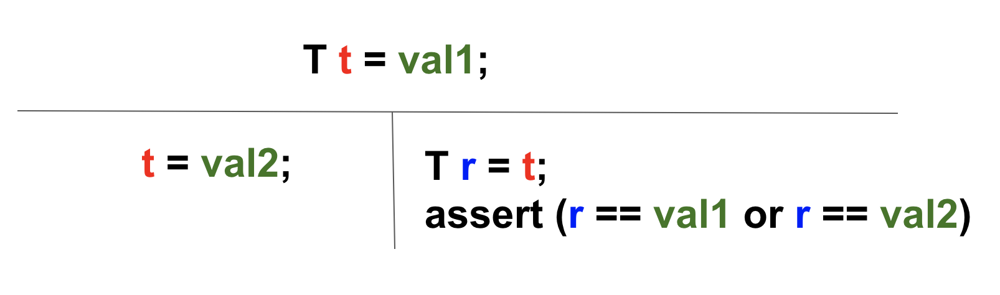
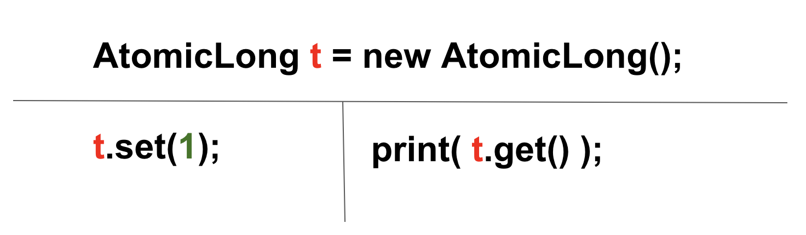
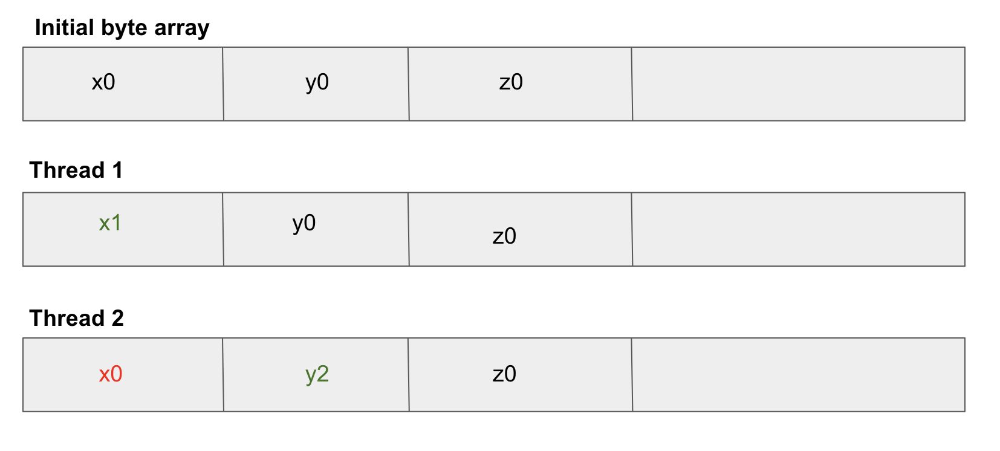
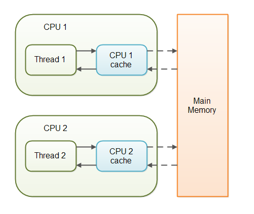
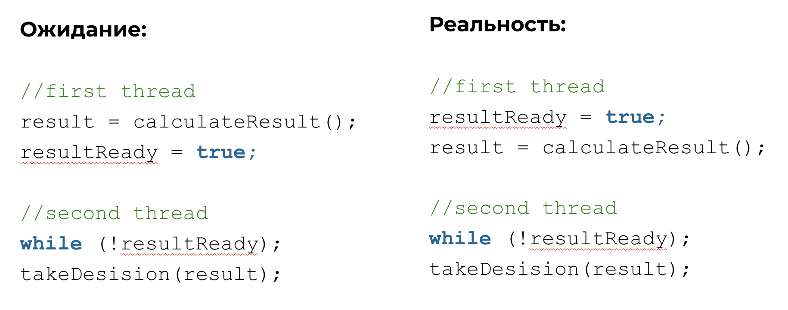
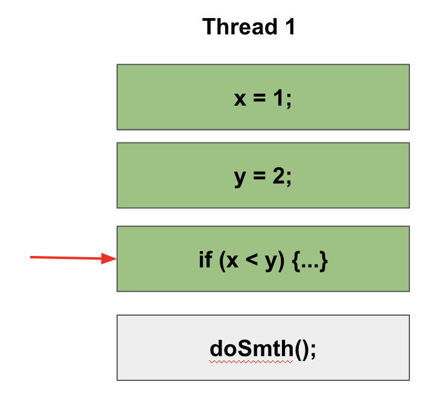
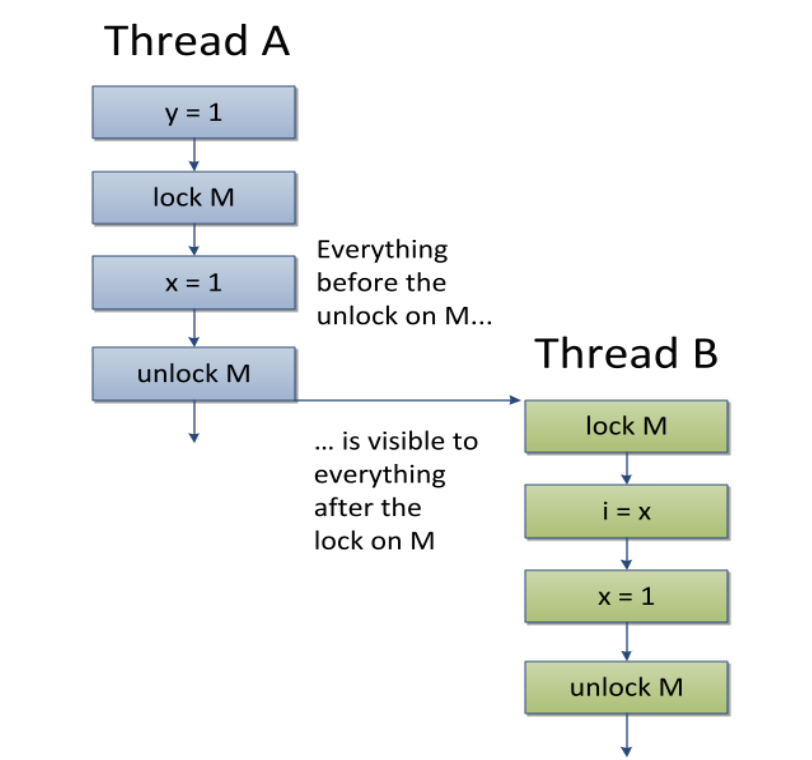
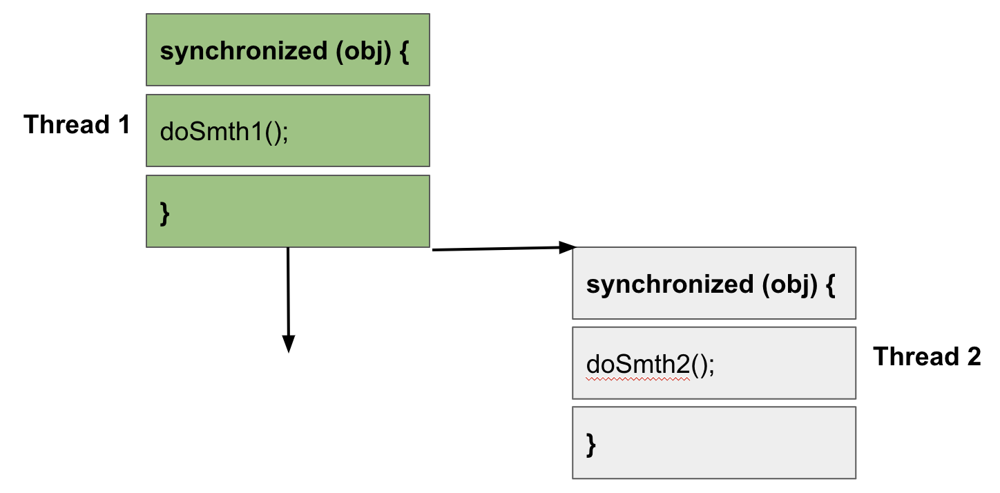

# Модель памяти Java (Java Memory Model)

## Atomicity

Для всех базовых типов, кроме long и double:

В чем проблема long и double?
 - long и double в Java не атомарны*

(*) long и double в java занимают 64 бита. Если запустить программу на 32-разрядном процессоре,
чтение и запись таких переменных может быть не атомарной (т.к. будет производиться в 2 такта: 32 бита + 32 бита).
 
Как сделать long и double атомарными?

- использовать ключевое слово **volatile**
- использовать атомики (внутри уже есть volatile)

* внутри используется volatile
* print(t.get()) выведет либо 0, либо 1

Подробнее про то, как работают атомики:
* http://java-online.ru/concurrent-atomic.xhtml
* https://itsobes.ru/JavaSobes/kak-ustroeny-atomiki/

## Word tearing

Некоторые процессоры не позволяют записывать один байт в ОЗУ, что приводит к проблеме, называемой word tearing. 
Представьте, что у нас есть массив байт. Один поток записывает первый байт, а второй поток пытается записать значение в рядом стоящий байт. 
Но если процессор не может записать один байт, а только целое машинное слово, то запись рядом стоящего байта может быть проблематичной. 
Если просто считать машинное слово, обновить один байт и записать обратно, то мы помешаем другому потоку.

В Java Memory Model проблема word tearing решена (разработчик с такой проблемой сталкиваться не будет). 

## Visibility

**Проблема:**

Один поток может временно сохранить значение некоторых полей не в основную память, а в регистры или локальный кэш процессора, 
таким образом второй поток, выполняемый на другом процессоре, читая из основной памяти, может не увидеть последних изменений поля. 

И наоборот, если поток на протяжении какого-то времени работает с регистрами и локальными кэшами, читая данные оттуда, 
он может сразу не увидеть изменений, сделанных другим потоком в основную память.

**Решение:**

Проблема видимости актуальных значений переменных может быть решена с помощью ключевого слова **volatile**,
которое позволяет сохранять значения не в кэше CPU, а в общей памяти. Таким образом, потоки, которые выполняются в том числе 
и на разных процессорах, всегда будут получать актуальное значение каких-либо общих переменных.

* volatile int a;
* volatile String s;
* volatile Transaction t;  

## Reordering

**Проблема:**

Для увеличения производительности процессор/компилятор могут переставлять местами некоторые инструкции/операции. 
Вернее, с точки зрения потока, наблюдающего за выполнением операций в другом потоке, операции могут быть выполнены не в том порядке, 
в котором они идут в исходном коде.

**Решение:**

Синхронизировать такие участки кода.

## Happens before

Happens-before обозначает, что если операция X связана отношением happens-before с операцией Y, то весь код следуемый за операцией Y, 
выполняемый в одном потоке, видит все изменения, сделанные другим потоком, до операции X.

Связь happens-before транзитивна, т.е. если X happens-before Y, а Y happens-before Z, то X happens-before Z.

* В рамках одного потока любая операция happens-before любой операцией следующей за ней в исходном коде.

* Освобождение лока (unlock) happens-before захвата того же лока (lock).

* Выход из synhronized блока/метода happens-before вход в synhronized блок/метод на том же мониторе.

* Запись volatile поля happens-before чтения того же самого volatile поля.

* Завершение метода run экземпляра класса Thread happens-before выход из метода join() или возвращение false методом isAlive() экземпляром того же треда.

* Вызов метода start() экземпляра класса Thread happens-before начало метода run() экземпляра того же треда.

* Завершение конструктора happens-before начало метода finalize() этого класса.

* Вызов метода interrupt() на потоке happens-before когда поток обнаружил, что данный метод был вызван либо путем выбрасывания 
исключения InterruptedException, либо с помощью методов isInterrupted() или interrupted().

## Полезные ссылки

https://youtu.be/iB2N8aqwtxc (рекомендуем посмотреть)

https://habr.com/ru/post/440590/

http://www.javaspecialist.ru/2011/06/java-memory-model.html

https://urvanov.ru/2019/04/02/java-memory-model/
