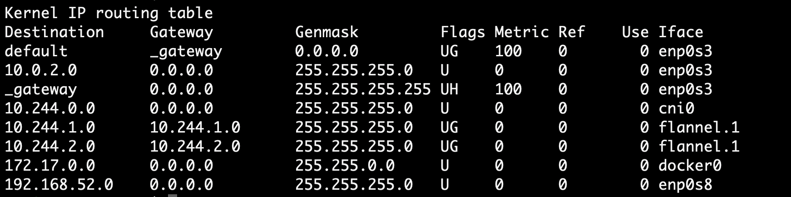

# Kubernetes

1. [Vagrant](vagrant)
1. [Ansible scripts](ansible)

## Как устроен контейнер
Виртуальные машины делят между собой физические ресурсы хоста: процессор, память, дисковое пространство, сетевые интерфейсы. 
На каждой ВМ устанавливаем нужную ОС и запускаем приложения. Недостатком такого подхода является то,
что значительная часть ресурсов хоста расходуется не на полезную нагрузку (работа приложений), а на работу нескольких ОС.  
Альтернативным подходом к изоляции приложений являются контейнеры. Само понятие контейнеров не ново и давно известно в Linux.
Идея состоит в том, чтобы в рамках одной ОС выделить изолированную область и запускать в ней приложение.
В этом случае говорим о виртуализации на уровне ОС. В отличие от ВМ контейнеры изолированно используют свой кусочек ОС:
файловая система, дерево процессов, сетевые интерфейсы и др. 


Т.о. приложение, запущенное в контейнере, думает, что оно одно во всей ОС. Изоляция достигается за счет использования
таких Linux-механизмов, как namespaces и control groups. Если говорить просто, то namespaces обеспечивают изоляцию в рамках ОС,
а control groups устанавливают лимиты на потребление контейнером ресурсов хоста, чтобы сбалансировать распределение ресурсов
между запущенными контейнерами. 

Docker использует некоторые возможности ядра Linux: 
* **namespaces** – docker использует технологию namespaces для организации изолированных рабочих пространств,
которые мы называем контейнерами. Когда мы запускаем контейнер, docker создает набор пространств имен для данного контейнера.
Это создает изолированный уровень, каждый аспект контейнера запущен в своем пространстве имен, и не имеет доступ к внешней системе. 
* **control groups (cgroups)** – docker также использует технологию cgroups или контрольные группы. Ключ к работе приложения
в изоляции, предоставление приложению только тех ресурсов, которые вы хотите предоставить. Это гарантирует,
что контейнеры будут хорошими соседями. Контрольные группы позволяют разделять доступные ресурсы железа и если необходимо,
устанавливать пределы и ограничения. Например, ограничить возможное количество памяти контейнеру. 
* **AuFS (Union File System)** – образ использует AuFS (advanced multi-layered unification filesystem - вспомогательная
файловая система, образующая каскадно-объединённое монтирование для файловых систем Linux) для прозрачного монтирования
файловых систем. С помощью bootfs загружается контейнер в память. Затем bootfs отмонтируется, освобождая память.
Далее работает rootfs (от Debian, Ubuntu и т.д.). В Docker rootfs монтируется в режиме «только для чтения».
Когда контейнер запущен из образа, монтируется файловая система на запись поверх необходимого слоя ниже. 


### Что происходит, когда запускается образ
* скачивается образ Linux; 
* создает контейнер: когда образ получен, docker использует его для создания контейнера; 
* инициализирует файловую систему и монтирует read-only уровень: контейнер создан в файловой системе и read-only уровень добавлен образ; 
* инициализирует сеть/мост: создает сетевой интерфейс, который позволяет docker-у общаться хост машиной; 
* установка IP адреса: находит и задает адрес; 
* запускает указанный процесс: запускает ваше приложение; 
* обрабатывает и выдает вывод вашего приложения: подключается и логирует стандартный вход, вывод и поток ошибок вашего приложения, что бы вы могли отслеживать, как работает ваше приложение. 

### Структура образа 
Образ состоит из слоев, каждый из которых представляет собой неизменяемую файловую систему, а по-простому набор файлов и директорий.
Образ в целом представляет собой объединенную файловую систему (Union File System), которую можно рассматривать как результат
слияния файловых систем слоев. Объединенная файловая система умеет обрабатывать конфликты, например, когда в разных слоях
присутствуют файлы и директории с одинаковыми именами. Каждый следующий слой добавляет или удаляет какие-то файлы
из предыдущих слоев. В данном контексте «удаляет» можно рассматривать как «затеняет», т.е. файл в нижележащем слое остается,
но его не будет видно в объединенной файловой системе. 


Слои являются read only и, если в слое MyApplication нужно изменить файл, находящийся в низлежащем слое, то файл сначала
копируется в нужный слой, а потом в нем изменяется, оставаясь в исходном слое в первозданном виде.
Неизменяемость слоев позволяет использовать их всеми образами на хосте. 

## K8S
Kubernetes — это портативная расширяемая платформа с открытым исходным кодом для управления
контейнеризованными рабочими нагрузками и сервисами, которая облегчает как декларативную
настройку, так и автоматизацию.

**Традиционная эра развертывания**: Ранее организации запускали приложения на физических
серверах. Не было никакого способа определить границы ресурсов для приложений на физическом
сервере, и это вызвало проблемы с распределением ресурсов. Например, если несколько приложений
выполняются на физическом сервере, могут быть случаи, когда одно приложение будет занимать большую часть ресурсов,
и в результате чего другие приложения будут работать хуже. Решением этого было запустить каждое приложение
на другом физическом сервере. Но это не масштабировалось, поскольку ресурсы использовались не полностью,
из-за чего организациям было накладно поддерживать множество физических серверов.

**Эра виртуального развертывания**: В качестве решения была представлена виртуализация.
Она позволила запускать несколько виртуальных машин (ВМ) на одном физическом сервере. Виртуализация изолирует приложения
между виртуальными машинами и обеспечивает определенный уровень безопасности, поскольку информация
одного приложения не может быть свободно доступна другому приложению.

Виртуализация позволяет лучше использовать ресурсы на физическом сервере и обеспечивает лучшую масштабируемость,
поскольку приложение можно легко добавить или обновить, кроме этого снижаются затраты на оборудование и многое другое.
С помощью виртуализации можно превратить набор физических ресурсов в кластер одноразовых виртуальных машин.

Каждая виртуальная машина представляет собой полноценную машину, на которой выполняются все компоненты,
включая собственную операционную систему, поверх виртуализированного оборудования.

**Эра контейнеров**: Контейнеры похожи на виртуальные машины, но у них есть свойства изоляции для совместного использования
операционной системы (ОС) между приложениями. Поэтому контейнеры считаются легкими. Подобно виртуальной машине,
контейнер имеет свою собственную файловую систему, процессор, память, пространство процесса и многое другое.
Поскольку они не связаны с базовой инфраструктурой, они переносимы между облаками и дистрибутивами ОС.

    

Контейнеры стали популярными из-за таких дополнительных преимуществ как:
* Гибкое создание и развертывание приложений: простота и эффективность создания образа контейнера по сравнению
с использованием образа виртуальной машины.
* Непрерывная разработка, интеграция и развертывание: обеспечивает надежную и частую сборку и развертывание
образа контейнера с быстрым и простым откатом (благодаря неизменности образа).
* Разделение задач между Dev и Ops: создавайте образы контейнеров приложений во время сборки/релиза,
а не во время развертывания, тем самым отделяя приложения от инфраструктуры.
* Наблюдаемость охватывает не только информацию и метрики на уровне ОС, но также информацию о работоспособности
приложений и другие сигналы.
* Идентичная окружающая среда при разработке, тестировании и релизе: на ноутбуке работает так же, как и в облаке.
* Переносимость облачных и операционных систем.
* Управление, ориентированное на приложения: повышает уровень абстракции от запуска ОС на виртуальном оборудовании
до запуска приложения в ОС с использованием логических ресурсов.
* Слабосвязанные, распределенные, гибкие, выделенные микросервисы: вместо монолитного стека на одной большой
выделенной машине, приложения разбиты на более мелкие независимые части, которые можно динамически развертывать и управлять.
* Изоляция ресурсов: предсказуемая производительность приложения.
* Грамотное использование ресурсов: высокая эффективность и компактность.

Чтобы работать с Kubernetes, вы используете объекты API Kubernetes для описания желаемого состояния вашего кластера:
* какие приложения или другие рабочие нагрузки вы хотите запустить;
* какие образы контейнеров они используют;
* количество реплик;
* какие сетевые и дисковые ресурсы.

Вы устанавливаете желаемое состояние, создавая объекты с помощью API Kubernetes, обычно через интерфейс командной строки kubectl.

После того, как вы установили желаемое состояние, Плоскость управления Kubernetes заставляет текущее состояние кластера
соответствовать желаемому состоянию с помощью генератора событий жизненного цикла подов (Pod Lifecycle Event Generator).
Для этого Kubernetes автоматически выполняет множество задач, таких как запуск или перезапуск контейнеров,
масштабирование количества реплик данного приложения и многое другое.
Плоскость управления Kubernetes состоит из набора процессов, запущенных в вашем кластере. Мастер Kubernetes —
это коллекция из трех процессов, которые выполняются на одном узле в вашем кластере, который обозначен как главный узел.
Это процессы: kube-apiserver (API-сервер), kube-controller-manager(менеджер контроллеров), kube-scheduler (планировщик)
и хранилище (etcd). Мастер координирует все процессы в кластере, такие как планирование выполнения приложений,
сохранение требуемого состояния приложений, а также их масштабирование и обновление.

Каждый отдельный неосновной узел в кластере выполняет два процесса:
* kubelet – получение инструкций от управляющего узла и приведение подов на данном рабочем узле в желаемое состояние;
* kube-proxy, сетевой прокси, который обрабатывает сетевые сервисы Kubernetes на каждом узле.

Kubernetes содержит ряд абстракций, которые представляют состояние системы: развернутые контейнеризованные приложения
и рабочие нагрузки, связанные с ними сетевые и дисковые ресурсы и другую информацию, что делает кластер.

Кластер k8s состоит из набора машин, называемых нода (Node), которые запускают контейнеризированные приложения.
Каждая нода содержит поды (Pod) – минимальная сущность для развертывания в кластере. K8S управляет подами, а не контейнерами
напрямую.

Основные объекты Kubernetes включают в себя:
* Pod – минимальная сущность для развертывания в кластере. Каждый Pod предназначен для запуска одного (обычно) экземпляра конкретного приложения.
Если есть необходимость горизонтального масштабирования, то можно запустить несколько экземпляров Pod'а - в терминологии Kubernetes это называется репликацией.
* Service – абстракция, которая определяет логический набор подов и политику доступа к ним, как сетевой сервис. Pod'ы создаются и удаляются,
чтобы поддерживать описанное состояние кластера. Каждый pod имеет свой ip-адрес, но эти адреса не постоянны и могут меняться со временем
(при переезде между node'ами, например). 
* Volumes – персистентное хранилище данных внутри кластера. По-умолчанию используется emptyDir – volume создается на диске
и существует до тех пор, пока Pod работает на этой node'е. ConfigMaps так же могут использоваться как volume для
конфигурирования приложения.
* Namespace – виртуальные кластеры размещенные поверх физического.
* Secrets – используются для хранения конфиденциальной информации.

Kubernetes также содержит абстракции более высокого уровня, которые опираются на Контроллеры (Controller) для создания базовых объектов
и предоставляют дополнительные функциональные и удобные функции. Они включают:
* Deployment – обеспечивает декларативные обновления для Pods и ReplicaSets. Наиболее распространенный тип описания ресурсов,
состоит из секции описания Pod'а (`.spec.template`), метки (`.spec.template.metadata.labels`), информация о репликации (`.spec.replicas`).
* DaemonSet – гарантирует, что определенный Pod будет запущен на всех нодах.
* StatefulSet – используется для управления приложениями с сохранением состояния.
* ReplicaSet – гарантирует, что определенное количество экземпляров подов (Pods) будет запущено в кластере в любой момент времени.

Есть еще несколько служебных сущностей, которые упрощают работу с k8s:
* Labels (метки) – используются для маркирования объектов кластера, а так же для выбора этих объектов `kubectl get pods -l app=simple-web-server`.
* ConfigMaps – абстракция над файлами конфигурации, позволяет разделять настройки приложения и сами контейнеры,
избавляя от необходимости упаковывать конфиги в docker-образ.
* Annotations (аннотации) – используются для добавления собственных метаданных к объектам.
Такие клиенты, как инструменты и библиотеки, могут получить эти метаданные. Эту информацию можно хранить в БД или
файлах, но это усложняет процесс создания общих клиентских библиотек. Некоторые примеры информации, которая может быть в аннотациях:
    * Поля, управляемые декларативным уровнем конфигурации. Добавление этих полей в виде аннотаций позволяет
    отличать их от значений по умолчанию, установленных клиентами или серверами, а также от автоматически
    сгенерированных полей и полей, заданных системами автоматического масштабирования.
    * Информация репозитории, сборке, выпуске или образе.
    * Информация об источнике пользователя или инструмента/системы, например, URL-адреса связанных объектов из других компонентов экосистемы.

## Сетевая модель
В основе сетевого устройства Kubernetes — у каждого пода свой уникальный IP. IP пода делится между всеми его контейнерами
и является доступным (маршрутизируемым) для всех остальных подов. На каждой машине есть сетевой интерфейс eth0, внутри пода
тоже есть eth0, на host-машине они подключены к интерфейсу vethxxx. Эти интерфейсы общаются с eth0 через
ethernet bridge интерфейс cni0 (docker использует аналогичный docker0).


  
  

Взаимодействие между узлами реализуется либо посредством ARP-запросов (L2), либо с помощью таблицы роутинга (ip-маршрутизация, L3).
В примере ниже роутинг строится на таблице маршрутизации. Для более гибкой маршрутизации строятся т.н. overlay-сети.
Overlay-сеть выглядит как единая сеть между нодами. Предположим, нужно выполнить запрос из pod'а 1 на одной ноде к pod'у 3
на другой node'е. Запрос из пода попадает в интерфейс cni0, а потом в интерфейс flannel.1, который оборачивает запрос в UDP-пакет
и отправляет его дальше через интерфейс eth0. Если нужный pod находится на той же машине, то маршрутизация решается на уровне cni0 интерфейса.

.gif)
.png)

## Внешняя маршрутизация
При публикации сервиса есть три типа указания внешнего адреса:
* NodePort – открывает указанный порт для всех nodes, и трафик на этот порт перенаправляется сервис.
* ClusterIP – обеспечивает сервис внутри кластера, к которому могут обращаться другие приложения внутри кластера. Внешнего доступа нет.
* LoadBalance – балансировщик нагрузки, выставляется наружу за пределы кластера.

#### Ingress
Ingress – интеллектуальный контроллер, который помимо балансировки может еще выполнять функции gateway. 
Что бы этот ресурс начал работу в кластере k8s должен быть установлен Ingress Controller, который настроит реверсивный
прокси в соответствии с Ingress объектом.

## Пример деплоя minikube
```shell script
# запускаем minikube
minikube start --vm=true
# для использования локальных images пробросить docker в minikube (https://minikube.sigs.k8s.io/docs/handbook/pushing/)
minikube -p minikube docker-env
# включаем ingress для minikube
minikube addons enable ingress
 
cd simple-web-server
# собираем приложение 
./gradlew clean build
# заворачиваем в docker
docker build -t simple-web-server:v1 .
cd ../k8s
# разворачиваем postgres
kubectl apply -f postgres-deployment.yml
# разворачиваем приложение
kubectl apply -f web-app-deployment.yml
# проверяем, что все успешно запустилось
kubectl kubectl logs -f deployment/simple-web-server
# смотрим внешний ip для нашего сервиса
kubectl get svc
# добавляем в /etc/hosts k8s-test.local
echo -n '192.168.64.2 k8s-test.local' | sudo tee -a /etc/hosts
# Проброс порта postgres наружу
kubectl port-forward service/postgres-serive 5432:5432
# проверка работы
curl -X POST k8s-test.local/users -d '{"firstName":"Alex","lastName":"Romanov", "age":30}' -H 'Content-Type: application/json' | jq
curl -X GET k8s-test.local/users | jq
```

## Пример развертывания в кластере Kubernetes
```shell script
# Запускаем 3 виртуальных машины (2 ядра, 2Гб памяти на каждую)
cd vagrant
# vagrant box https://app.vagrantup.com/romanow/boxes/ansible-box
vagrant up
# Запускаем кластер на этих машинах
cd ../ansible
ansible-playbook -i inventories/local/static.yml --vault-password-file=.vault_pass kubernetes.yml
# Копируем параметры кластера в локальный kubectl
scp -r ansible@192.168.52.10:~/.kube ~/
# Проверяем что кластер поднят
kubectl get nodes

cd ../k8s
# docker образы http://hub.docker.com/r/romanowalex/simple-web-server/tags
# разворачиваем postgres
kubectl apply -f postgres-deployment.yml
# разворачиваем приложение
kubectl apply -f web-app-deployment.yml
# проверяем, что все успешно запустилось
kubectl kubectl logs -f deployment/simple-web-server


# TODO перенести в ansible
# Устанавливаем менеджер пакетов helm для k8s
curl https://baltocdn.com/helm/signing.asc | sudo apt-key add -
sudo apt-get install apt-transport-https --yes
echo "deb https://baltocdn.com/helm/stable/debian/ all main" | sudo tee /etc/apt/sources.list.d/helm-stable-debian.list
sudo apt-get update
sudo apt-get install helm

# Устанавливаем nginx-ingress controller (от nginx inc.)
helm repo add nginx-stable https://helm.nginx.com/stable
helm repo update
helm install nginx nginx-stable/nginx-ingress

# Устанавливаем 
helm repo add bitnami https://charts.bitnami.com/bitnami
helm repo update
helm install metallb bitnami/metallb
# конфигурируем MetalLB
cat <<EOF >> metallb-cm.yml 
apiVersion: v1
kind: ConfigMap
metadata:
  namespace: metallb-system
  name: config
data:
  config: |
    address-pools:
    - name: default
      protocol: layer2
      addresses:
      - 192.168.52.101-192.168.52.110
EOF
kubectl apply -f metallb-cm.yml

# смотрим внешний ip для нашего сервиса
kubectl get svc
# добавляем в /etc/hosts k8s-test.local
echo -n '192.168.52.11 k8s-test.local' | sudo tee -a /etc/hosts

# проверка работы
curl -X POST k8s-test.local/users -d '{"firstName":"Alex","lastName":"Romanov", "age":30}' -H 'Content-Type: application/json' | jq
curl -X GET k8s-test.local/users | jq
```

## Масштабирование и обновление
```shell script
kubectl scale --replicas=3 deployment/simple-web-server
kubectl get deployment --watch
kubectl set image deployment/simple-web-server simple-web-server=romanowalex/simple-web-server:v1.2
kubectl rollout status deployment/simple-web-server
curl http://k8s-test.local
``` 

## Ссылки
1. [Kubernetes docs](https://kubernetes.io/ru/docs/concepts/)
1. [Kubernetes](https://ealebed.github.io/tags/kubernetes/)
1. [Установка Kubernetes с помощью Minikube](https://kubernetes.io/ru/docs/setup/learning-environment/minikube/)
1. [Компоненты Kubernetes](https://kubernetes.io/ru/docs/concepts/overview/components/)
1. [Шпаргалка по kubectl](https://kubernetes.io/ru/docs/reference/kubectl/cheatsheet/)
1. [Основы Kubernetes](https://habr.com/ru/post/258443)
1. [Знакомство с Kubernetes](https://ealebed.github.io/tags/kubernetes/)
1. [Kubernetes: Flannel networking](https://blog.laputa.io/kubernetes-flannel-networking-6a1cb1f8ec7c)
1. Иллюстрированное руководство по устройству сети в Kubernetes [Часть 1 и 2](https://habr.com/ru/company/flant/blog/346304/), [Часть 3](https://habr.com/ru/company/flant/blog/433382/)
1. [Container Networking Interface (CNI) — сетевой интерфейс и стандарт для Linux-контейнеров](https://habr.com/ru/company/flant/blog/329830/)