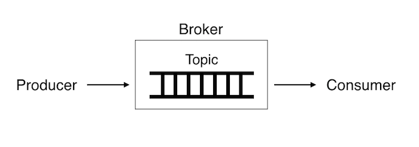

# Kafka

1. [Vagrant](vagrant)
1. [Ansible scripts](ansible)

## Работа с очередями

Традиционные распределенные системы, построенные на основе RMI, обладают рядом существенных недостатков. Назовем основные:
* Клиент, сделав запрос, должен ждать ответа от сервера. Эта синхронность является основным недостатком традиционных систем
в том случае, когда процесс обработки запроса занимает относительно большой промежуток времени. Это может решаться с помощью
регистрации callback'ов, вызываемых  по окончанию асинхронных операций, но это все равно выполнение операций в одном потоке данных.
* И клиент, и сервер должны быть активны в момент вызова. Если клиент попытается сделать запрос к серверу,
который не активен в данный момент, он получит сообщение об ошибке.

Часто помимо обработки самого запроса требуется сделать много дополнительных вещей, связанных с самим запросом лишь косвенно:
запись статистики, инкременты счетчиков. Эти операции можно выполнить на этапе постобработки после того,
как ответ был отдан пользователю. Однако иногда описанного выше подхода с постобработкой данных недостаточно.
Действия, которые надо совершить с ними, могут занимать слишком много времени, а ресурсы веб-сервера не безграничные.
В таком случае помогает следующий архитектурный паттерн — сохраните данные в некое промежуточное хранилище,
а затем обработайте их с помощью отдельного асинхронного процесса. То есть данные собираются сейчас, а обрабатываются тогда,
когда будет удобно.

Существует целый класс однотипных задач, для которых принципиален порядок обработки. Для подобных целей используют инструмент,
называемый очередями. Очередь — абстрактный тип данных с дисциплиной доступа к элементам
«первый пришёл — первый вышел» (FIFO, First In — First Out). Добавление элемента возможно лишь в конец очереди,
выборка — только из начала очереди, при этом выбранный элемент из очереди удаляется.

Использование очередей позволяет сделать систему более устойчивой к сбоям. Если операция завершилась неудачно,
запрос на её выполнение можно вернуть в очередь и направить на обработку на другого worker’а. Также очередь сообщений
позволяет вам еще и функционально развязать куски всей вашей экосистемы и позволить кому-то сломаться
без общей деградации на время.

Для решения проблем RMI используется коммуникация на основе сообщений – Messaging System. В отличие от традиционных систем,
в Messaging System приложения общаются не напрямую, а посредством Message-Orientated Middleware (MOM) - программного обеспечения,
предоставляющего инфраструктуру для принятия и отправки сообщений.

Если один компонент системы хочет послать сообщение другому компоненту, он посылает данное сообщение в MOM,
а MOM уже самостоятельно пересылает его адресату. Таким образом, приложение, пославшее сообщение, не должно ждать ответа,
и может продолжать свою текущую деятельность.  
Ни приложение, посылающее сообщение, ни адресат данного сообщения не обязаны быть активными в одно и то же время.

Если адресат сообщения не активен, то MOM гарантирует, что сообщение будет доставлено как только адресат станет активным.

Компоненты системы не связаны напрямую друг с другом (decoupled), а потому возможно перенесение компонентов
с одного хоста на другой в runtime без ущерба для работоспособности системы.

Существует две основных модели обмена сообщениями:
* Point-to-Point – Эта  модель применяется, когда одному или нескольким компонентам (senders) необходимо послать
сообщение одному компоненту-адресату (receiver). Для промежуточного хранения данных используется очередь.
В общем случае в модели Point-to-Point может несколько отправителей и несколько приемщиков сообщений,
но MOM доставит сообщение только одному.
* Publisher-Subscriber – эта модель применима, когда одному или нескольким компонентам (publishers) необходимо
послать сообщение одному или нескольким компонентам-адресатам (subscribers). Данная модель основана на понятии message topic.
Publishers посылают сообщения в topic, и все subscribers данного topic получают эти сообщения.

Введем некоторые определения:
* Topic – это название категории в котором сообщения публикуются производителями сообщений.
* Broker - некоторый сервер, выполняющий функции очереди.

## Проблемы работы с очередями


Java Message Service (JMS) – это Java API для работы с Message-Oriented Middleware. При реализации обмена через JMS мы получаем:
* enterprise integration – позволяет клиентам на различных платформах и языках взаимодействовать друг с другом;
* Прозрачность – клиенту не нужно знать, где находится потребитель;
* надежная коммуникация - поставщик и потребитель не обязаны быть доступны в одно и то же время.
* масштабируемость – позволяет легко выполнить горизонтальное масштабирование с помощью добавления серверов;
* асинхронное взаимодействие - клиент отправляет сообщение на брокер и не должен ожидать ответа от потребителя;
* слабая связность – клиенты и сервисы связаны друг с другом лишь посредством публикации/приема сообщений,
что не накладывает на них дополнительных ограничений.



Рассмотрим два главных заблуждения:
1. В JMS не может быть потерянных сообщений: приложение должно быть написано таким образом,
чтобы при недоставленном сообщении оно не осталось в подвешенном состоянии. Это происходит потому,
что в брокерах для ускорения их работы:
    * не включен persistence по-умолчанию;
    * нет транзакционности на стороне отправителя и получателя;
    * нет ожидания ACK на стороне отправителя;
    * AUTO ACK на стороне получателя;
    * запись на диск на брокере буферизуются, т.е. при отключении питания на брокере сообщения, хранящиеся в буфере, потеряются.
1. Не бывает дубликатов сообщений. Для предотвращения дважды отправленных сообщений на producer’е добавляется
уникальный id в message header. Этот заголовок читается на брокере, и он отфильтровывает дубликаты (если включена политика
поиска дубликатов). Consumer должен отправить ACK на провайдер когда получил сообщение (сообщение может оказаться битым,
т.к. мы уже ответили брокеру что все ОК, мы его не получим), либо отвечать ACK только когда сообщение обработалось.
Это очень сильно снижает производительность. Так же в момент отправки ACK сеть может упасть и брокер не получив
информацию отправит сообщение еще раз, и если сообщение не содержит никакого уникального идентификатора,
то мы не сможем с уверенностью сказать что именно это сообщение было уже обработано.

## Apache Kafka
Apache Kafka – это распределенная система передачи сообщений, которая позволяет разрабатывать приложения,
использующие потоковые данные в режиме реального времени. Kafka обеспечивает бесшовную интеграцию между поставщиками
информации и потребителями, не блокируя поставщиков информации. Для персистентности сообщений используется write-ahead-log,
т.е. записи сначала добавляются в специальный лог, работающий только на append, а уже после выполняется сама операция.

Поток сообщений (message) определенного типа в терминах службы называется темой (topic). Сообщение – это полезный
для некоего процесса комплект данных, тогда как тема – это категория, в соответствии с которой публикуется то или иное сообщение.
Каждый topic делится на один или более патриции (partitions), сообщения внутри патриции упорядочены по времени добавления
и имеют уникальный идентификатор (уникальный внутри партиции), называющийся смещением (offset).


Сообщения в разных патрициях не упорядочены друг с другом! Если требуется упорядоченность сообщений в рамках топика,
то нужно использовать лишь одну партицию. Партии используются для обеспечения параллельной обработки сообщений.

Важное понятие в Kafka: consumer groups, – объединение нескольких потребителей в группу таким образом,
чтобы каждое сообщение приходило одному потребителю. Другими словами, это масштабирование на чтение. Участники группы
читают из разных партиций. Отсюда следует, что количество партиций должно быть не меньше, чем средний размер группы.


Внутри каждой патриции есть replication factor – количество реплик (байт-в-байт), на которые пришедшее сообщение дублируется.
Для каждой патриции выбирается лидер (leader)– сервер, на который происходит запись, а c лидера в свое очередь
происходит репликация данных на N других серверов для обеспечения отказоустойчивости.

Данные удаляются по прошествию какого-то времени, а не в момент прочтения сообщения. В случае падения потребителя,
после перезапуска потребитель просто продолжает читать с определенного места.

Для передачи сообщения полезно задавать key:payload, по этому ключу Kafka вычисляет в какую реплику передавать сообщение.
Т.е. если требуется упорядоченность сообщений, то для одинаковых сообщений нужно задавать key. Например, если пользователь
изменяет email, то сообщение должно передаваться в виде key: <user_id>, payload: <email>, таким образом они попадут
в одну и ту же партицию и будут обработаны в нужном порядке.

Для контроля объема топика используется несколько подходов:
* Remove old items – данные хранятся некоторый промежуток времени (задается в настройках).
* Log compaction – хранятся только срез последних данных по ключу, все остальные данные удаляются,
т.е. на каком-то расстоянии от головы очереди из старых записей по каждому ключу выбирается последняя запись,
а все старые удаляются, при этом порядок следования не меняется. Лог разбивается на две части: head и tail.
Kafka гарантирует, что в tail все ключи уникальны, потому что tail обновлялся при предыдущем проходе процесса упаковщика.
Вес новые записи добавляются в в конец head. При этом в compacted topic будут храниться _все_ старые записи
по уникальному ключу. Если нужно эти записи удалить, то нужно отправить  в очередь сообщение с key:null,
null будет рассматриваться как tombstone и запись будет удалена.


Поскольку Kafka по своей природе является распределенной системой, кластер состоит из нескольких брокеров.
Тема разбивается на партиции, и каждый брокер отвечает за хранение одной или нескольких партиций.
Это дает возможность множеству производителей и потребителей публиковать и использовать сообщения для своих целей одновременно.

## Пример работы
```shell script
# Создаем топик TestTopic
./kafka-topics.sh --zookeeper 192.168.51.10:2181 --create --replication-factor 1 --partitions 1 --topic TestTopic
# Список всех топиков
./kafka-topics.sh --list --zookeeper 192.168.51.10:2181
# с разных машин
./kafka-console-consumer.sh --bootstrap-server 192.168.51.11:9092,192.168.51.12:9092 --topic TestTopic
./kafka-console-producer.sh --bootstrap-server 192.168.51.11:9092,192.168.51.12:9092 --topic TestTopic

./gradlew wrapper
./gradlew clean build
./gradlew kafka-consumer:bootRun
./gradlew kafka-producer:bootRun
```

## Ссылки
1. [Understanding Kafka with Legos](https://www.youtube.com/watch?v=Q5wOegcVa8E)
1. [Нужен ли нам JMS в мире современных Java-технологий](https://www.youtube.com/watch?v=ExjPxDxkmFo)
1. [Lessons learned form Kafka in production](https://www.youtube.com/watch?v=1vLMuWsfMcA)
1. [Kafka на Kubernetes: а по Хуану ли сомбреро?](https://www.youtube.com/watch?v=utZeAdeFblY)
1. [Один раз в год сады цветут: разбор семантики «exactly once» Apache Kafka](https://www.youtube.com/watch?v=PgkRhlUwYyE)
1. [Когда всё пошло по Кафке](https://www.youtube.com/watch?v=A_yUaPARv8U)
1. [Kafka Architecture: Log Compaction](http://cloudurable.com/blog/kafka-architecture-log-compaction/index.html)